# IoT Virtual Lab: Full Sensor Manual

This comprehensive guide contains the technical specifications, physical theory, wiring diagrams, and experimental procedures for all 17 sensors (including 16 physical and 1 simulated proximity signal) included in the IoT Virtual Laboratory.

---

## Table of Contents

1. [Hardware Pinout Master List](#hardware-pinout-master-list)
2. [BMP280: Altimeter & Pressure](#bmp280-altimeter--pressure)
3. [DHT11: Temperature & Humidity](#dht11-temperature--humidity)
4. [Flame Detector](#flame-detector)
5. [Hall Effect: Magnetic Sensor](#hall-effect-magnetic-sensor)
6. [HC-SR04: Ultrasonic Distance](#hc-sr04-ultrasonic-distance)
7. [IR Obstacle Avoidance](#ir-obstacle-avoidance)
8. [Joystick Module](#joystick-module)
9. [LDR: Light Dependent Resistor](#ldr-light-dependent-resistor)
10. [MAX30102: Pulse Oximeter & Heart-Rate](#max30102-pulse-oximeter--heart-rate)
11. [MQ-2: Combustible Gas & Smoke](#mq-2-combustible-gas--smoke)
12. [MQ-3: Alcohol Vapor](#mq-3-alcohol-vapor)
13. [PIR: Passive Infrared Motion](#pir-passive-infrared-motion)
14. [Proximity Sensor (Inductive)](#proximity-sensor-inductive)
15. [Sound Sensor (Microphone)](#sound-sensor-microphone)
16. [LM35: Analog Temperature](#lm35-analog-temperature)
17. [Thermistor: NTC Temperature](#thermistor-ntc-temperature)
18. [Tilt Switch](#tilt-switch)
19. [Touch Sensor (Capacitive)](#touch-sensor-capacitive)

---

<br>

<div style="page-break-after: always;"></div>

<a name="hardware-pinout-master-list"></a>
## Hardware Pinout Master List

This document outlines the dedicated pin assignments for all 17 sensors in the Virtual Lab physical hardware kit. This map ensures zero conflicts when building the final prototype.

### The Microcontroller
**Target Board:** Arduino Mega 2560 + ESP8266 Combo Board

**Total Pins Available:**
- Digital: 54
- Analog: 16
- *(Total: 70 Pins)*

---

### I2C Bus Pins (Shared)
*The I2C bus supports up to 127 devices simultaneously on just two wires. Both of these sensors connect in parallel to the exact same pins.*

| Sensor | Description | Pin Type | Assigned Pin |
| :--- | :--- | :--- | :--- |
| **All I2C Sensors** | Data Line (SDA) | Dedicated I2C | **Pin 20** |
| **All I2C Sensors** | Clock Line (SCL) | Dedicated I2C | **Pin 21** |
*Devices on this bus: BMP280, MAX30102*

---

### Analog Sensors (ADC)
*These sensors output a variable voltage from 0V to 5V and must be connected to the dedicated `A` pins.*

| Sensor | Description | Pin Type | Assigned Pin |
| :--- | :--- | :--- | :--- |
| **MQ-2** | Gas & Smoke | Analog | **A0** |
| **MQ-3** | Alcohol Vapor | Analog | **A1** |
| **Joystick (X)** | Horizontal Axis | Analog | **A2** |
| **Joystick (Y)** | Vertical Axis | Analog | **A3** |
| **LDR** | Light Sensor | Analog | **A4** |
| **Flame** | IR Fire Intensity | Analog | **A5** |
| **Sound** | Audio Signal | Analog | **A6** |
| **NTC Thermistor**| Analog Temp Probe| Analog | **A7** |

---

### Digital Sensors
*These sensors output simple HIGH (5V) or LOW (0V) logic.*

| Sensor | Description | Pin Type | Assigned Pin |
| :--- | :--- | :--- | :--- |
| **DHT11** | Humidity/Temp Data Line | Digital Input | **Pin 2** |
| **HC-SR04 (Trig)** | Ultrasonic Trigger | Digital Output | **Pin 3** |
| **HC-SR04 (Echo)** | Ultrasonic Echo | Digital Input | **Pin 4** |
| **Touch** | Capacitive Finger Sensor | Digital Input | **Pin 5** |
| **Hall Effect** | Magnetic Field Sensor | Digital Input | **Pin 6** |
| **Joystick (SW)** | Joystick Push-Button | Digital Input | **Pin 7** |
| **Flame (DO)** | IR Fire Detector Signal | Digital Input | **Pin 8** |
| **Sound (DO)** | Mic Loudness Threshold | Digital Input | **Pin 9** |
| **PIR** | Passive Infrared Motion | Digital Input | **Pin 10** |
| **Proximity** | Inductive Metal Sensor | Digital Input | **Pin 11** |
| **Tilt** | Vibration / Angle Switch | Digital Input | **Pin 12** |
| **IR Object** | Infrared Proximity | Digital Input | **Pin 14** |

---

### Internal Wi-Fi Communication
*These pins are permanently occupied by the physical copper traces connecting the Mega 2560 brain to the ESP8266 brain on the combo board.*

| Connection | Description | Pin Type | Assigned Pin |
| :--- | :--- | :--- | :--- |
| **Serial Tx0** | Mega Transmit to ESP | Hardware Serial | **Pin 1** |
| **Serial Rx0** | Mega Receive from ESP | Hardware Serial | **Pin 0** |

---

### Hardware Summary Table

| Category | Used | Available | Remaining |
| :--- | :--- | :--- | :--- |
| **Analog** | 8 | 16 | **8** (A8 to A15) |
| **Digital** | 16* | 54 | **38** |
| **Total** | **24** | **70** | **46 unused pins** |

*(Note: The 16 Digital pins used include the 2 I2C pins and the 2 internal Serial pins for the Wi-Fi chip).*

---

### Power Distribution Strategy (CRITICAL)
**WARNING:** The onboard 5V linear voltage regulator of the Arduino Mega 2560 cannot safely provide enough sustained current to power all 17 sensors simultaneously (especially the MQ-series gas heaters and HC-SR04 ultrasonic pulses). Attempting to do so may overheat the regulator, causing a brown-out that resets the microcontroller.

**Solution (The Common Ground):** 
1. Use a dedicated external **5V DC Power Supply** (e.g., a 5V 3A buck converter or wall adapter) to power the VCC rails of all the sensors.
2. Power the Mega 2560 via its barrel jack or USB.
3. **CRITICAL:** You must connect the Ground (GND) wire of the external 5V supply to the GND pin of the Arduino Mega to ensure a common reference voltage, while keeping their 5V lines completely separated.

---

### Communication Architecture (Mega ↔ ESP)
The custom combo board relies on a dual-microcontroller architecture to handle heavy loads:
- **Data Acquisition (ATmega2560):** Handles all real-time sensor polling, ADC conversions, string parsing, and I2C requests.
- **Network Interface (ESP8266):** Handles the Wi-Fi stack and WebSocket/REST transmission to the Node.js backend to ensure the main sensor loop is never blocked by network latency.
- **The Bridge:** The ATmega2560 packages the 17 sensor readings into a minified JSON string and transmits it over **Hardware Serial** (Pins 0/1) at 115200 baud to the waiting ESP8266.
- **The Handshake:** A stop-and-wait ACK protocol ensures the Mega never overwhelms the ESP8266's buffer while it is busy with network tasks.

---

To achieve a smooth 10Hz unified data stream to the Node.js backend without blocking the main `loop()`, sensors are sampled using a non-blocking timeline:

- **Fast Polling (20Hz / 50ms):** Joystick, Touch, Tilt, Sound Digital, Hall, IR.
- **Medium Polling (5Hz / 200ms):** MQ-2, MQ-3, LDR, Flame, Sound Analog.
- **Slow Polling (0.5Hz / 2s):** DHT11 (hardware limited).
- **Transmission (10Hz / 100ms):** Full system state sent to ESP8266.

---

### PCB-Ready Pin Reservation (Future Expansion)
With 48 pins remaining, the system is designed to be highly expandable for future lab modules:
- **A6 - A15:** Reserved exclusively for future analog expansion (e.g., Soil Moisture, UV light intensity sensors, Flex sensors).
- **PWM Output Pins (Subset of 2-13):** Reserved for potential actuator feedback loops (e.g., controlling a Servo motor based on Joystick X/Y, or RGB LED status indicators).
- **SPI Bus (Pins 50, 51, 52, 53):** Kept completely unassigned to allow for future SD-card offline data logging or high-speed RFID readers.

<div style="page-break-after: always;"></div>

<a name="bmp280-altimeter--pressure"></a>
## BMP280: Altimeter & Pressure

### 1. Description
The **GY-BMP280-3.3** is a high-precision, low-power environmental sensor module based on the Bosch Sensortec BMP280 chip. It measures both **barometric pressure** and **temperature**, and can function as an **altimeter**.

### 2. Theory & Physics
#### Piezoresistive Effect
Inside the chip is a tiny, sealed vacuum reference cavity covered by a thin silicon diaphragm. When atmospheric pressure changes, the diaphragm bends, changing the resistance of embedded piezoresistors.

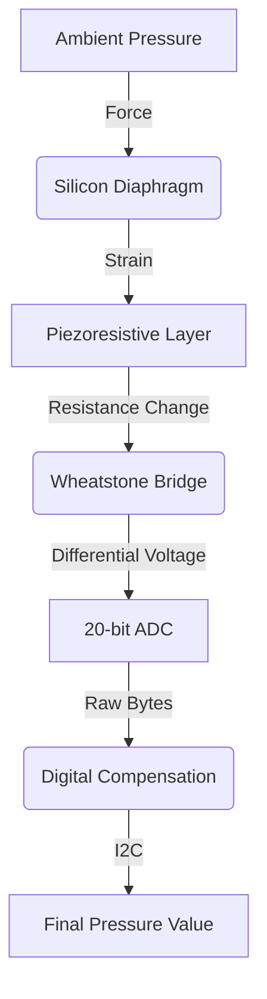

#### Altimeter Math
Atmospheric pressure decreases exponentially as altitude increases:
`H = 44330 * [1 - (P / P0)^(1/5.255)]`

### 3. Hardware Wiring (Arduino Mega)
| BMP280 Pin | Arduino Mega Pin | Description |
| :--- | :--- | :--- |
| **VCC** | 3.3V | *CRITICAL: Do not use 5V* |
| **GND** | GND | Common Ground |
| **SCL** | Pin 21 (SCL) | I²C Clock Line |
| **SDA** | Pin 20 (SDA) | I²C Data Line |

### 4. Arduino Implementation
```cpp
#include <Wire.h>
#include <Adafruit_BMP280.h>
Adafruit_BMP280 bmp;

void setup() {
  Serial.begin(115200);
  if (!bmp.begin(0x76)) {
    Serial.println("BMP280 not found!");
    while (1);
  }
}

void loop() {
  Serial.print("Temp = "); Serial.print(bmp.readTemperature());
  Serial.print(" Pressure = "); Serial.println(bmp.readPressure() / 100.0F);
  delay(2000);
}
```

<div style="page-break-after: always;"></div>

<a name="dht11-temperature--humidity"></a>
## DHT11: Temperature & Humidity

### 1. Description
The **DHT11** is a basic digital temperature and humidity sensor. It outputs a digital signal on a single data pin once every 2 seconds.

### 2. Theory & Physics
- **Humidity:** Uses a moisture-absorbing substrate between electrodes; capacitance changes as humidity alters the dielectric constant.
- **Temperature:** Uses an NTC thermistor where resistance drops as temperature rises.

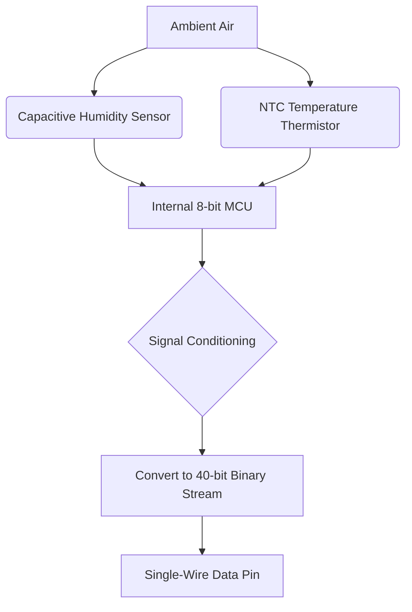

### 3. Hardware Wiring
| DHT11 Pin | Arduino Mega Pin | Description |
| :--- | :--- | :--- |
| **VCC** | 5V | Power Supply |
| **DATA** | Digital Pin 2 | Data signal |
| **GND** | GND | Common Ground |

<div style="page-break-after: always;"></div>

<a name="flame-detector"></a>
## Flame Detector

### 1. Description
The **Flame Sensor** is an optical sensor sensitive to near-infrared (NIR) radiation emitted by hydrocarbon combustion (760nm - 1100nm).

### 2. Theory & Physics
Equipped with an IR Phototransistor and a black daylight-blocking filter, it generates a current surge when hit by high-energy IR photons from a fire.

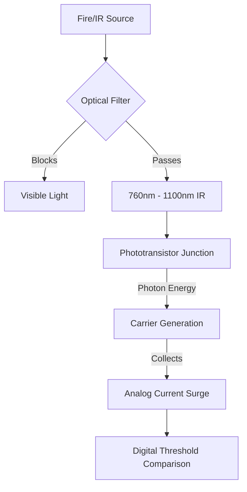

### 3. Hardware Wiring
| Flame Sensor Pin | Arduino Mega Pin | Description |
| :--- | :--- | :--- |
| **VCC** | 5V | Power Supply |
| **GND** | GND | Common Ground |
| **AO** | Analog Pin A5 | Analog intensity |
| **DO** | Digital Pin 8 | Threshold alarm |

<div style="page-break-after: always;"></div>

<a name="hall-effect-magnetic-sensor"></a>
## Hall Effect: Magnetic Sensor

### 1. Description
Detects magnetic fields. Used for RPM sensing, lid closure detection, and brushless motor control.

### 2. Theory & Physics
When a magnetic field ($B$) is perpendicular to a current ($I$) flowing through a semiconductor, the **Lorentz Force** pushes charge carriers to one side, creating the **Hall Voltage**.

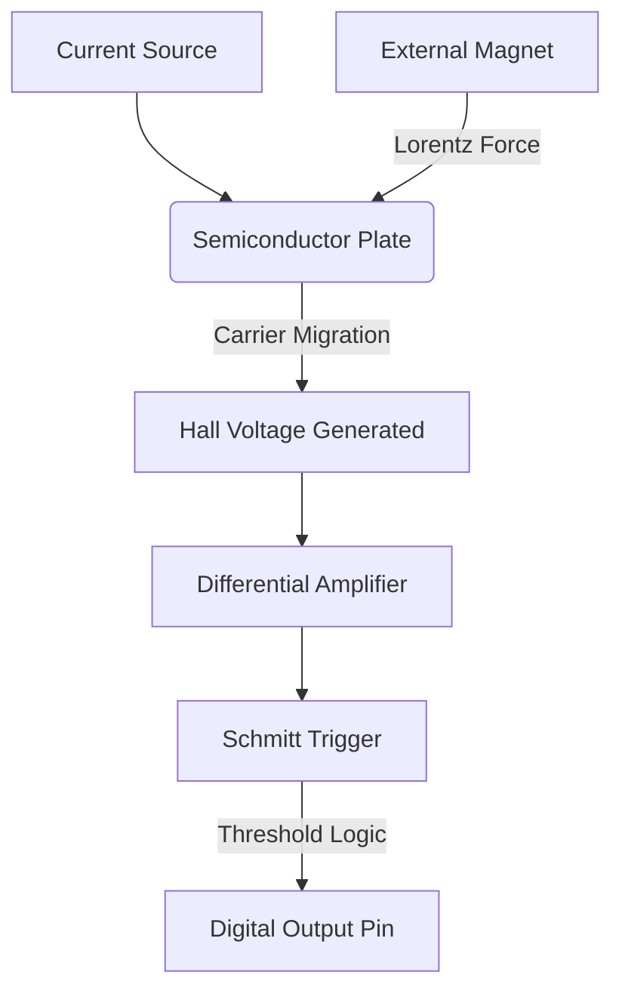

### 3. Hardware Wiring
| Hall Pin | Arduino Mega Pin | Description |
| :--- | :--- | :--- |
| **VCC** | 5V | Power Supply |
| **GND** | GND | Common Ground |
| **OUT** | Digital Pin 6 | Signal (LOW on detection) |

<div style="page-break-after: always;"></div>

<a name="hc-sr04-ultrasonic-distance"></a>
## HC-SR04: Ultrasonic Distance

### 1. Description
Measures distance (2cm to 400cm) using echolocation. It consists of an ultrasonic transmitter and receiver.

### 2. Theory & Physics
- **Trigger:** Send 10µs pulse.
- **Flight:** Speed of sound ≈ 343 m/s (0.0343 cm/µs).
- **Calculation:** `Distance = (Time * 0.0343) / 2`.

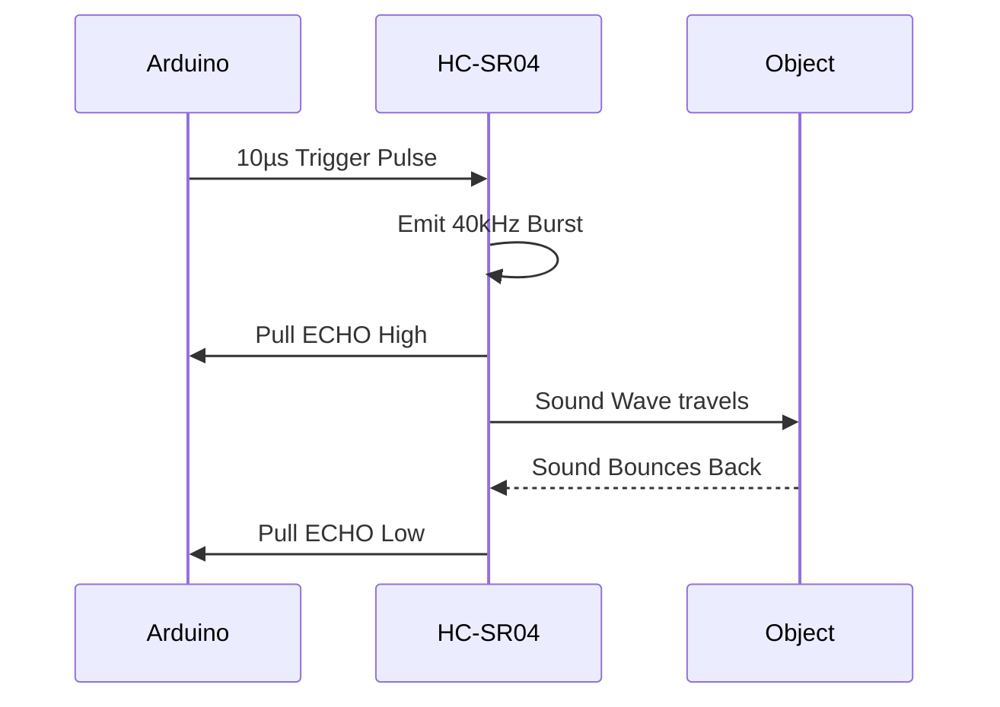

### 3. Hardware Wiring
| HC-SR04 Pin | Arduino Mega Pin | Description |
| :--- | :--- | :--- |
| **VCC** | 5V | Power |
| **TRIG** | Digital Pin 3 | Output trigger |
| **ECHO** | Digital Pin 4 | Input echo |
| **GND** | GND | Ground |

<div style="page-break-after: always;"></div>

<a name="ir-obstacle-avoidance"></a>
## IR Obstacle Avoidance

### 1. Description
An active sensor that emits IR light and detects its reflection to determine proximity (short range).

### 2. Theory & Physics
Relies on **Albedo** (reflectivity). White surfaces reflect well (trigger far); black surfaces absorb (trigger close or never).

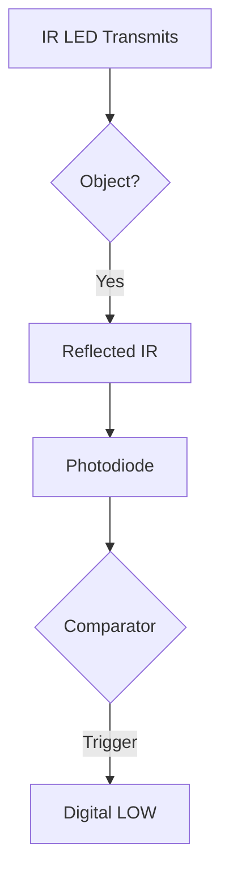

### 3. Hardware Wiring
| IR Pin | Arduino Mega Pin | Description |
| :--- | :--- | :--- |
| **VCC** | 5V | Power |
| **GND** | GND | Ground |
| **OUT** | Digital Pin 13 | Signal (LOW on detection) |

<div style="page-break-after: always;"></div>

<a name="joystick-module"></a>
## Joystick Module

### 1. Description
Dual-axis analog input with a integrated pushbutton. Uses two rotary potentiometers at right angles.

### 2. Theory & Physics
Each axis is a resistive voltage divider. Center voltage is ~2.5V (ADC 512). Moving the stick changes the wiper position on carbon tracks.

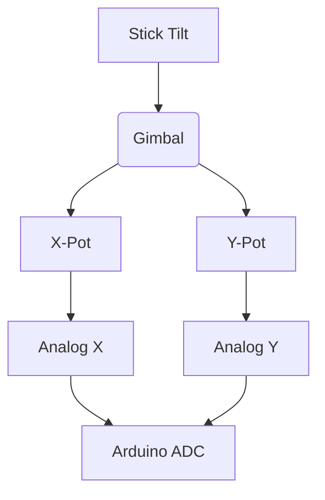

### 3. Hardware Wiring
| Joystick Pin | Arduino Mega Pin | Description |
| :--- | :--- | :--- |
| **VCC** | 5V | Power |
| **GND** | GND | Ground |
| **VRx** | Analog A2 | X-axis |
| **VRy** | Analog A3 | Y-axis |
| **SW** | Digital 7 | Button (needs Pull-up) |

<div style="page-break-after: always;"></div>

<a name="ldr-light-dependent-resistor"></a>
## LDR: Light Dependent Resistor

### 1. Description
Resistance decreases as light intensity increases. Uses Cadmium Sulfide (CdS) photoconductivity.

### 2. Theory & Physics
Photons hit the semiconductor, exciting electrons into the conduction band and increasing charge carrier density.

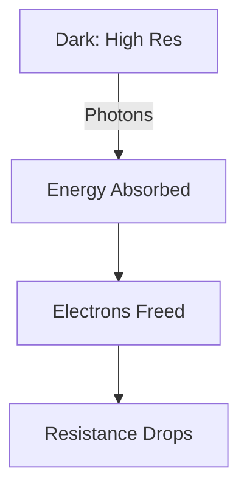

### 3. Hardware Wiring (Voltage Divider)
| LDR Pin | Arduino Mega Pin | Description |
| :--- | :--- | :--- |
| **VCC** | 5V | Power |
| **GND** | GND | Ground |
| **AO** | Analog A4 | Intensity signal |

<div style="page-break-after: always;"></div>

<a name="max30102-pulse-oximeter--heart-rate"></a>
## MAX30102: Pulse Oximeter & Heart-Rate

### 1. Description
Medical-grade optical sensor measuring heart rate and SpO2 using Photoplethysmography (PPG).

### 2. Theory & Physics
Oxygenated blood (HbO2) absorbs more IR light; deoxygenated blood (Hb) absorbs more Red light. The AC pulse ripple is used to calculate BPM.

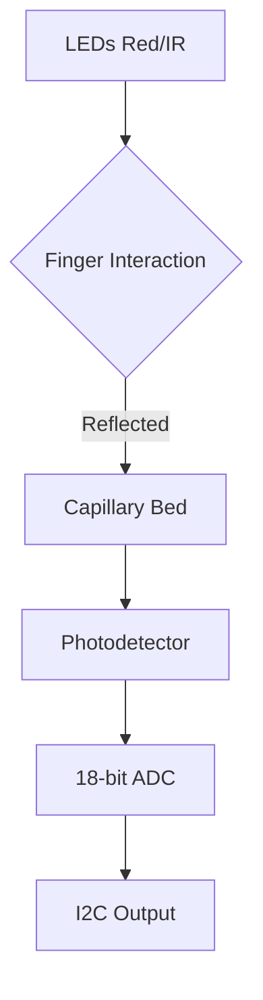

### 3. Hardware Wiring (I2C)
| MAX30102 Pin | Arduino Mega Pin | Description |
| :--- | :--- | :--- |
| **VIN** | 3.3V or 5V | Power |
| **GND** | GND | Ground |
| **SCL** | Pin 21 (SCL) | Clock Line |
| **SDA** | Pin 20 (SDA) | Data Line |

<div style="page-break-after: always;"></div>

<a name="mq-2-combustible-gas--smoke"></a>
## MQ-2: Combustible Gas & Smoke

### 1. Description
Analog sensor sensitive to LPG, propane, methane, and smoke. Contains a 5V internal heater.

### 2. Theory & Physics
Uses Tin Dioxide (SnO2). In clean air, adsorbed oxygen traps electrons (High Res). Combustible gases react with oxygen, releasing electrons and dropping resistance.

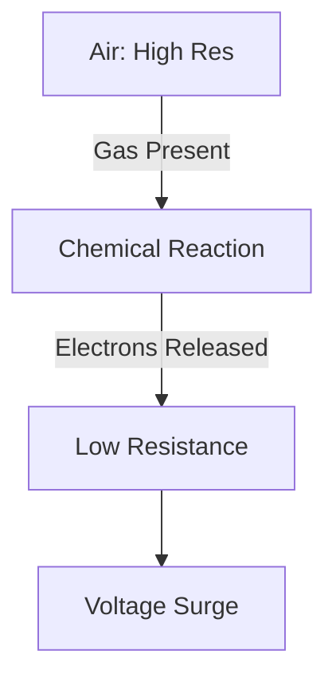

### 3. Hardware Wiring
| MQ-2 Pin | Arduino Mega Pin | Description |
| :--- | :--- | :--- |
| **VCC** | 5V (CRITICAL) | Powers heater |
| **GND** | GND | Ground |
| **A0** | Analog A0 | Concentration signal |

<div style="page-break-after: always;"></div>

<a name="mq-3-alcohol-vapor"></a>
## MQ-3: Alcohol Vapor

### 1. Description
Optimized for ethanol vapor detection. Similar heating mechanism to the MQ-2.

### 2. Theory & Physics
Redox reaction: `C2H5OH + 6O- -> 2CO2 + 3H2O + 6e-`. The released electrons collapse the potential barrier of the semiconductor.

### 3. Hardware Wiring
| MQ-3 Pin | Arduino Mega Pin | Description |
| :--- | :--- | :--- |
| **VCC** | 5V | Power |
| **GND** | GND | Ground |
| **A0** | Analog A1 | Alcohol signal |

<div style="page-break-after: always;"></div>

<a name="pir-passive-infrared-motion"></a>
## PIR: Passive Infrared Motion

### 1. Description
Detects thermal movement (humans emit 9.4µm IR). Uses pyroelectric material and a Fresnel lens.

### 2. Theory & Physics
Divided into "zones" by the faceted lens. Motion between zones creates a differential voltage spike detected by the logic chip.

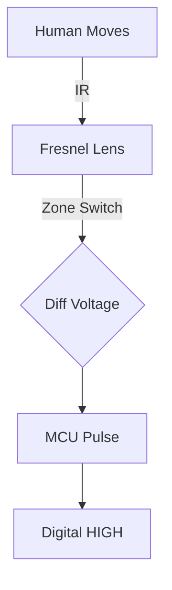

### 3. Hardware Wiring
| PIR Pin | Arduino Mega Pin | Description |
| :--- | :--- | :--- |
| **VCC** | 5V | Power |
| **OUT** | Digital Pin 10 | Signal |
| **GND** | GND | Ground |

<div style="page-break-after: always;"></div>

<a name="proximity-sensor-inductive"></a>
## Proximity Sensor (Inductive) - [SIMULATED]

### 1. Description
Industrial metal detector. In this laboratory, this sensor is implemented as a **Digital Twin** (Mock Data) to ensure educational safety while demonstrating Faraday's Law.

### 2. Theory & Physics
Oscillator creates EM field. Metallic objects induce **Eddy Currents**, which drain energy from the field, dampening the oscillator.

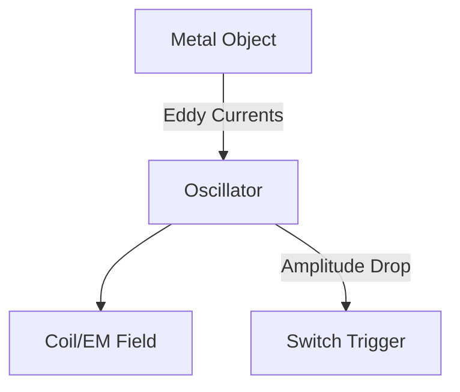

### 3. Hardware Wiring (NPN)
| Wire | Arduino Mega Pin | Description |
| :--- | :--- | :--- |
| **Brown** | 12V Ext | Power |
| **Blue** | GND | Common Ground |
| **Black** | Digital Pin 11 | Signal (needs Pull-up) |

<div style="page-break-after: always;"></div>

<a name="sound-sensor-microphone"></a>
## Sound Sensor (Microphone)

### 1. Description
Uses an Electret Condenser Mic to detect acoustic noise/claps.

### 2. Theory & Physics
Vibrating diaphragm changes capacitance. Internal FET and Op-amp compare audio levels against a preset potentiometer threshold.

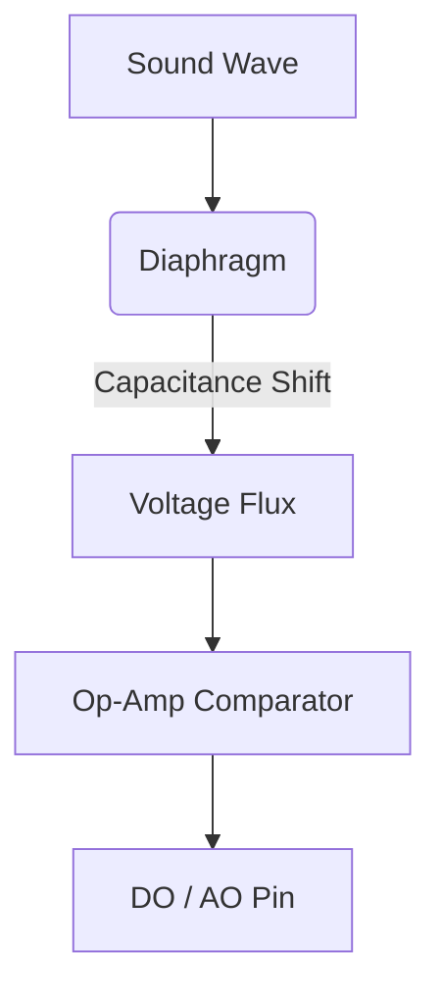

### 3. Hardware Wiring
| Pin | Arduino Pin | Description |
| :--- | :--- | :--- |
| **AO** | Analog A6 | Audio signal |
| **DO** | Digital Pin 9 | Threshold trigger |

<div style="page-break-after: always;"></div>

<a name="lm35-analog-temperature"></a>
## LM35: Analog Temperature

### 1. Description
Precision IC with linear output: **10mV per degree Celsius**.

### 2. Theory & Physics
Uses silicon bandgap reference. Base-emitter voltage ($V_{be}$) shifts linearly with heat.

### 3. Hardware Wiring
| Pin | Arduino Pin | Description |
| :--- | :--- | :--- |
| **VCC** | 5V | Power |
| **VOUT** | Analog A7 | 10mV/°C signal |
| **GND** | GND | Ground |

<div style="page-break-after: always;"></div>

<a name="thermistor-ntc-temperature"></a>
## Thermistor: NTC Temperature

### 1. Description
Negative Temperature Coefficient resistor. Resistance drops exponentially as heat increases.

### 2. Theory & Physics
Uses Steinhart-Hart equation for non-linear modeling. Requires a fixed voltage divider for ADC reading.

### 3. Hardware Wiring
| Pin | Arduino Pin | Description |
| :--- | :--- | :--- |
| **Data** | Analog A7 | Voltage divider signal |

<div style="page-break-after: always;"></div>

<a name="tilt-switch"></a>
## Tilt Switch

### 1. Description
A mechanical switch that orientation or inclination using a rolling metal ball.

### 2. Theory & Physics
Gravity points the ball to the bottom (closed) or rolls it away (open) at a ~45° incline.

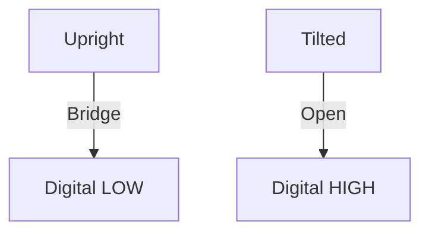

### 3. Hardware Wiring
| Pin | Arduino Pin | Description |
| :--- | :--- | :--- |
| **Leg 1** | Digital Pin 12 | Signal (needs Pull-up) |
| **Leg 2** | GND | Ground |

<div style="page-break-after: always;"></div>

<a name="touch-sensor-capacitive"></a>
## Touch Sensor (Capacitive)

### 1. Description
Reacts to finger proximity without moving parts using Parasitic Capacitance.

### 2. Theory & Physics
Calculates displacement in an electric field. The human body acts as a conductive plate in a capacitive system.

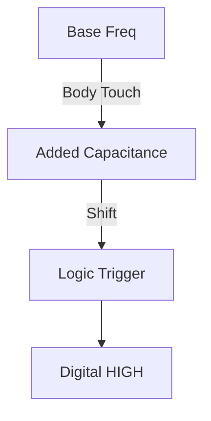

### 3. Hardware Wiring
| Pin | Arduino Pin | Description |
| :--- | :--- | :--- |
| **SIG** | Digital Pin 5 | Signal |

---
*End of Full Sensor Manual*
