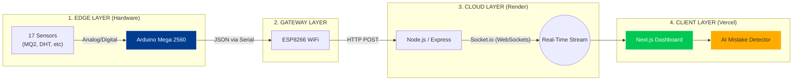
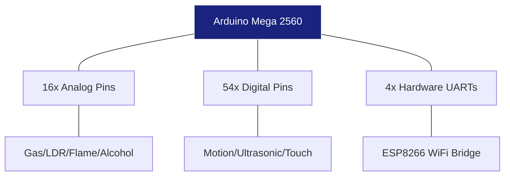
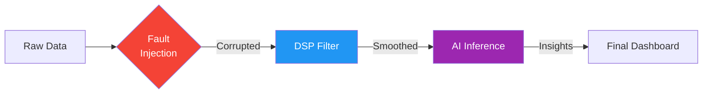
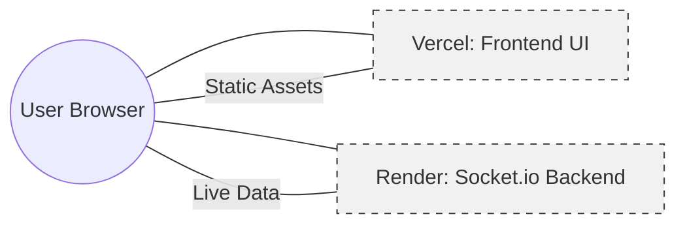
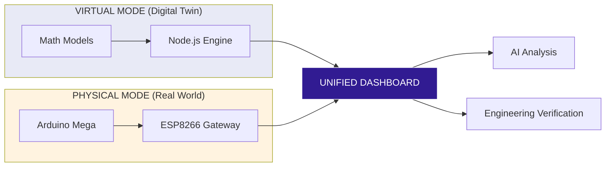

# 🖼️ Presentation Assets & Speaker Guide

This document contains high-quality diagrams, talking points, and visual layouts for your SEM6 project presentation.

---

## 🎨 Slide 1: Title Slide
**Visual Tip:** Use a high-resolution screenshot of your dashboard's main landing page.

**Speaker Notes:**
> "Good morning everyone. I am [Your Name], and today I am presenting my SEM6 project: **AI-Enabled Virtual Sensor Laboratory with Real-Time IoT Data**. This is a hybrid Digital Twin platform that bridges real-world hardware with intelligent software simulation to revolutionize remote engineering education."

---

## 🛠️ Slide 6: System Architecture (The "Three-Link" Flow)

Use this diagram to show the data movement:

---

## 🔧 Slide 7: Hardware Architecture

Use this to explain why the Mega is the "Brain":

**Speaker Notes:**
> "We chose the Arduino Mega 2560 over the Uno because it allows us to interface 17 sensors concurrently without complex multiplexing. It handles the high-density Data Acquisition (DAQ) while the ESP8266 handles the network stack independently to prevent logic blocking."

---

## 🤖 Slide 9: Algorithms & Intelligence

Use this to show the "Processing Chain":

**Speaker Notes:**
> "The innovation here isn't just seeing data—it's processing it. We can intentionally inject 'Stuck-at' faults to test resilience. We apply Moving Average filters to clean noisy signals. Finally, our AI engine monitors the stream for 'Floating Pins' or cross-sensor anomalies."

---

## ☁️ Slide 12: Deployment Architecture

**Speaker Notes:**
> "Our deployment is hybrid. We host the UI on Vercel for speed and global reach, but we host the core logic on Render because IoT requires 'Web Services' that support persistent WebSockets, which typical serverless platforms lack."

---

## 🎭 Slide 14: Novelty (Digital Twin Comparison)

Use this to highlight the "Hybrid" aspect:

---

## 📸 Final Tip: Screenshots
Instead of generic stock photos, take high-resolution screenshots of **your actual Vercel dashboard**.
1. **The Pulse Page:** Shows the Heartbeat waveform.
2. **The Mistakes Panel:** Shows the AI pointing out a floating pin.
3. **The DSP View:** Shows the Raw (red) vs. Processed (white) comparison on a chart.

This proves to your professor that the system is fully operational and built by you!

---

**Project status: READY FOR PRESENTATION** 🎓📊✨
