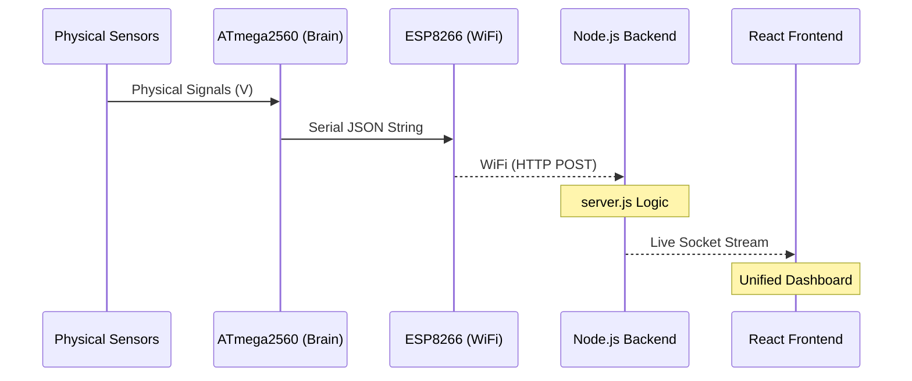

# 📔 Technical Manual: IoT Virtual Sensor Lab

Welcome to the official technical documentation for the **IoT Virtual Sensor Lab**. This manual provides a "picture perfect" guide to the hardware, software architecture, and individual sensor mechanics of the system.

---

## 🏗️ 1. Project Architecture & Data Flow

The project is built as a multi-tier system that bridges physical hardware with a modern web dashboard.

### 🔄 The Data Relay Race
1.  **Stage 1: The Observer (Arduino Mega)**
    - Reads digital and analog voltages from physical sensors.
    - Serializes reading into a JSON format.
2.  **Stage 2: The Gateway (ESP8266 WiFi)**
    - Receives Serial data from the Mega via an internal connection.
    - Beams data wirelessly to the backend server via HTTP POST.
3.  **Stage 3: The Hub (Node.js Backend)**
    - Processes incoming hardware data.
    - **Hybrid Mode:** Merges real hardware data with simulated "Mock" data for unplugged sensors.
    - Pushes data in real-time to browsers using WebSockets (Socket.IO).
4.  **Stage 4: The Interface (React Dashboard)**
    - Displays data in a beautiful, responsive UI.
    - Clearly labels "REAL HARDWARE" vs "Mock" data using visual badges.

---

## 🕹️ 2. Hardware Configuration: Mega + WiFi R3

This project uses a specialized **Mega + WiFi R3** board. It contains an **ATmega2560** and an **ESP8266** sharing a single board.

### ⚙️ DIP Switch Setup
The 8-way DIP switch manages how the internal components communicate.

| Mode | SW1 | SW2 | SW3 | SW4 | SW5 | SW6 | SW7 | SW8 |
| :--- | :---: | :---: | :---: | :---: | :---: | :---: | :---: | :---: |
| **Upload to Mega** | OFF | OFF | **ON** | **ON** | OFF | OFF | OFF | - |
| **Upload to ESP** | OFF | OFF | OFF | OFF | **ON** | **ON** | **ON** | - |
| **Normal Run Mode** | **ON** | **ON** | OFF | OFF | OFF | OFF | OFF | - |

> [!IMPORTANT]
> To stream data, you MUST set Switches **1 & 2 to ON** after flashing both chips.

---

## 💻 4. Firmware Internal Logic
For a deep dive into how the Arduino handles concurrency and sensor data:
- [FIRMWARE_CORE_LOGIC.md](file:///c:/Users/justi/Desktop/SEM6%20Project/iot-virtual-lab/documentation/FIRMWARE_CORE_LOGIC.md)

## 🧬 3. The Sensor Encyclopedia

Here is the complete technical breakdown of the 15 sensors supported by the laboratory.

| ID | Sensor | Pin (Mega) | Processing Logic | Physics / Working Principle |
| :-- | :--- | :---: | :--- | :--- |
| 1 | **HC-SR04** | D3, D4 | Echo Time Calculation | Measures distance via ultrasound "echo" bouncing. |
| 2 | **DHT11** | D5 | Digital Library (1-wire) | Measures moisture in substrate + Thermal resistance. |
| 3 | **MQ-2** | A0 | Analog Voltage (0-1023) | Sensitivity changes when Tin Dioxide reacts with smoke/gas. |
| 4 | **MQ-3** | A1 | Analog Voltage (0-1023) | Specialized heated sensor for alcohol vapor detection. |
| 5 | **Hall Effect** | D6 | Digital (HIGH/LOW) | Detects magnetic field presence using the Hall principle. |
| 6 | **Mic/Sound** | A3 | Analog Peak Detection | Piezoelectric diaphragm converts sound waves to voltage. |
| 7 | **IR Obstacle** | D13 | Digital (HIGH/LOW) | IR emitter/receiver pair detects light reflection. |
| 8 | **Flame** | A5 | Analog IR intensity | Photodiode tuned specifically to flicker wavelengths of fire. |
| 9 | **Proximity** | D11 | Digital (HIGH/LOW) | Short-range IR reflection for discrete object detection. |
| 10 | **BMP180** | SDA, SCL | I2C Communication | Piezoresistive pressure sensor + On-chip temperature. |
| 11 | **Touch** | D5 | Digital (HIGH/LOW) | Capacitive sensing; finger acts as a ground path. |
| 12 | **LDR** | A4 | Analog Bridge | Cadmium Sulfide cell drops resistance when hit by light. |
| 13 | **Tilt** | D12 | Digital (Integrated) | Metal ball inside a tube closes contact when angled. |
| 14 | **MAX30102** | SDA, SCL | I2C (Fiber-optic) | Shines Red/IR light through skin to measure blood flow. |
| 15 | **Joystick** | A2, A3, D7 | Analog X/Y + Digital Button | Dual-axis potentiometers (rotary resistors). |

---

## 🚀 4. End-to-End Setup Guide

### Step 1: WiFi Credentials
Open `firmware/esp8266_bridge/esp8266_bridge.ino` and enter your SSID, Password, and your **Render App URL** (`https://ai-virtual-sensor-lab-w-rt-iot-data.onrender.com/api/sensor-data`).

### Step 2: Flashing
1.  **Flash Mega:** Switches 3/4 ON -> Upload `Mega2560_Main.ino`.
2.  **Flash ESP:** Switches 5/6/7 ON -> Upload `esp8266_bridge.ino`.

### Step 3: Deployment
1.  Set Switches 1/2 ON.
2.  Connect to your Lab foam board wiring.
3.  Start your Backend (`npm start`) and Frontend (`npm run dev`).
4.  Open the dashboard and witness the data flow!

---

*Manual generated on: March 15, 2026*
