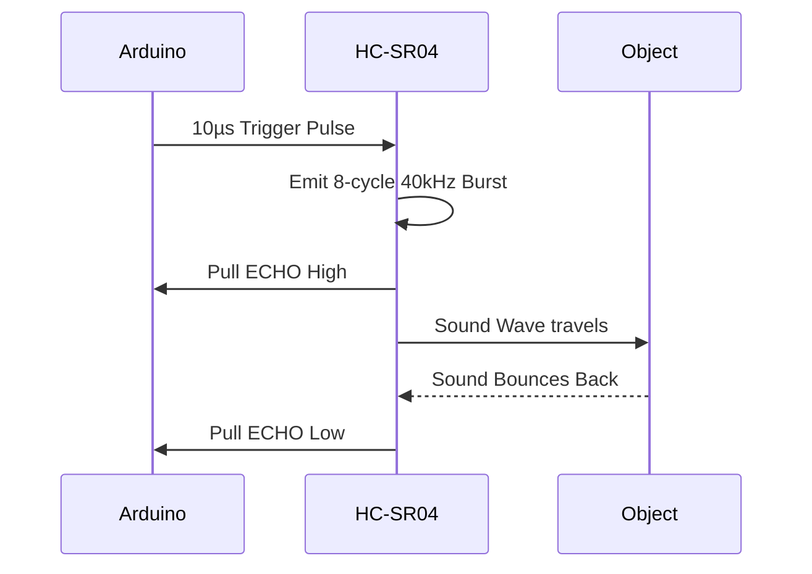

# HC-SR04 Ultrasonic Distance Sensor

## 1. Description
The **HC-SR04** uses ultrasonic sound waves to measure distance. It offers excellent non-contact range detection from 2cm to 400cm (4 meters) with an accuracy of roughly 3mm. 

It consists of an ultrasonic transmitter and a receiver module, resembling two metal "eyes".

---

## 2. Theory & Physics

### How it Works (Echolocation & Piezoelectricity)
The sensor acts like a bat or submarine sonar using physical sound waves.

#### 1. The Transducer (Piezoelectric Effect)
- Behind the metal mesh are **Piezoelectric Crystals**.
- **Inverse Piezoelectric Effect:** When the transmitter (Tx) receives an electrical pulse from the internal circuit, the crystal physically vibrates/contracts. This vibration creates a mechanical sound wave at 40kHz.
- **Direct Piezoelectric Effect:** When the echo returns and hits the receiver (Rx) crystal, the mechanical vibration of the sound hit generates a tiny electrical voltage, which the internal MCU detects as the "Echo return".

#### 2. Time of Flight (ToF) Logic
The sensor measures distance based on the interval between emission and reception.

#### Timing Flowchart:


### The Math (Physics of Sound)
- **Speed of Sound (v):** v ≈ 331.3 + 0.606 × T (m/s), where T is Temp in Celsius.
- For most lab settings (~20°C), this is **343 meters per second** (or 0.0343 cm/µs).
- **Round Trip Factor:** Since sound travels to the object and then back to the sensor, the distance is halved.

#### Conversion Diagram:

`Distance (cm) = (μs × 0.0343) / 2`
`Distance (cm) = μs / 58.3` (Constant for 20°C in air)

---

## 3. Communication Protocol (Pulse Width)
This is not I2C or Serial. It requires precision timing control of digital pins.
- **TRIG:** Must receive a 10 microsecond HIGH pulse to initiate.
- **ECHO:** Outputs a PWM-style variable-width pulse corresponding to the flight time. The Arduino function `pulseIn()` is used to precisely time this width in microseconds.

---

## 4. Hardware Wiring (Arduino Mega)

| HC-SR04 Pin | Arduino Mega Pin | Description |
| :--- | :--- | :--- |
| **VCC** | 5V | Power Supply |
| **TRIG** | D3 | Output from Arduino (Trigger pulse) |
| **ECHO** | D4 | Input to Arduino (Echo return pulse) |
| **GND** | GND | Common Ground |

---

## 5. Arduino Implementation Code

```cpp
#define TRIG_PIN 3
#define ECHO_PIN 4

void setup() {
  Serial.begin(115200);
  pinMode(TRIG_PIN, OUTPUT);
  pinMode(ECHO_PIN, INPUT);
}

void loop() {
  // 1. Ensure TRIG is low for a clean start
  digitalWrite(TRIG_PIN, LOW);
  delayMicroseconds(2);
  
  // 2. Send 10 microsecond pulse to trigger sensor
  digitalWrite(TRIG_PIN, HIGH);
  delayMicroseconds(10);
  digitalWrite(TRIG_PIN, LOW);
  
  // 3. Read the duration of the HIGH pulse on ECHO pin
  // Timeout set to 30000 µs (stops hanging if no object is found)
  long duration = pulseIn(ECHO_PIN, HIGH, 30000);
  
  // If pulseIn times out it returns 0
  if (duration == 0) {
    Serial.println("Out of range");
    delay(500);
    return;
  }
  
  // 4. Calculate the distance 
  float distanceCm = duration * 0.034 / 2.0;
  
  Serial.print("Distance: ");
  Serial.print(distanceCm);
  Serial.println(" cm");
  
  delay(100); // Small delay before next ping
}
```

---

## 6. Physical Experiments

1. **The Minimum Range Test:**
   - **Instruction:** Bring a flat book closer and closer to the "eyes" of the sensor.
   - **Observation:** Around 2 centimeters, the readings will suddenly fail, read `0`, or jump wildly.
   - **Expected:** Sound propagates in a cone, and the Tx and Rx are physically separated. Below 2cm, the echo bounces at an angle the Rx cylinder cannot 'see', causing false readings.

2. **The Absorption Test:**
   - **Instruction:** Try measuring the distance to a flat wooden board, and then try measuring the distance to a fluffy pillow at the exact same distance.
   - **Observation:** The wood will read perfectly. The pillow will give erratic numbers or say "Out of range".
   - **Expected:** Soft materials absorb sound energy. Ultrasonic sensors only work well against hard, flat, sound-reflective surfaces.

---

## 7. Common Mistakes & Troubleshooting

1. **`pulseIn()` Freezes the Arduino:**
   - *Symptom:* Code stops entirely if pointed at the sky or empty room.
   - *Cause:* `pulseIn(ECHO_PIN, HIGH)` waits forever for the pin to go low. If no echo returns, it hangs for a whole second by default.
   - *Fix:* Always add a timeout argument: `pulseIn(ECHO_PIN, HIGH, 30000);`
2. **"0 cm" Constant Output:**
   - *Cause:* Trigger and Echo pins are swapped in wiring vs code.
   - *Fix:* Ensure Ping goes to TRIG and Rx goes to ECHO.

---

## Required Libraries
This sensor relies strictly on built-in microprocessor timing (e.g., `pulseIn()`). **No external libraries are required.**

---

## AI Assessment Questions (UI Integration)
*The following questions are designed for the interactive UI quiz module to test student comprehension.*

**Q1: What is the operating frequency of the ultrasound burst emitted by the HC-SR04?**
- A) 20 Hz
- B) 400 Hz
- C) 40,000 Hz (40 kHz) *(Correct)*
- D) 2.4 GHz

**Q2: Why do we divide the calculated time-of-flight distance by two?**
- A) Because the speed of sound is too fast.
- B) Because the sound wave has to travel to the object and then bounce all the way back. *(Correct)*
- C) Because the sensor has two metal cylinders.
- D) To calibrate for temperature.

**Q3: Which materials will the HC-SR04 struggle the most to measure accurately?**
- A) Flat Wooden Boards
- B) Concrete Walls
- C) Soft, fluffy objects like pillows or clothes *(Correct)*
- D) Metal Sheets
