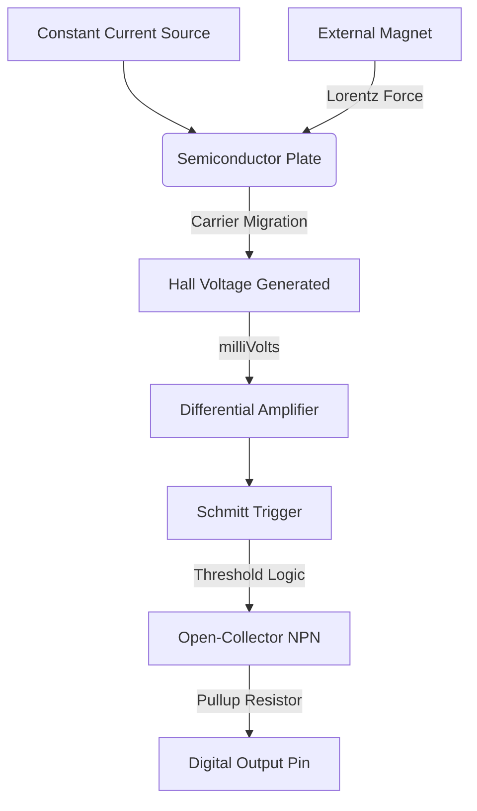
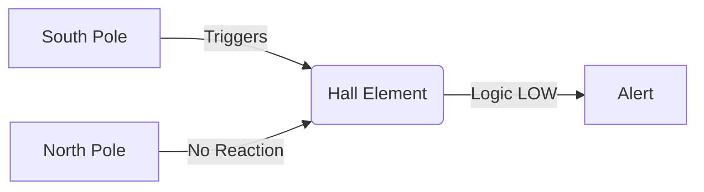

# Hall Effect Magnetic Sensor (e.g. A3144 or 49E)

## 1. Description
A **Hall Effect Sensor** is designed to detect the presence and strength of a magnetic field. 

They are incredibly common in modern appliances and vehicles. For instance, they determine how fast your car tires are spinning (ABS systems), detect if a laptop lid is closed (by sensing a tiny magnet in the screen bezel), or measure the speed of a BLDC motor.

There are two main types:
- **Digital (Switch):** Like the A3144. It outputs HIGH/LOW if a magnet is nearby or not.
- **Analog (Linear):** Like the 49E. It outputs a variable voltage depending on the exact *strength* and *polarity* (North vs South) of the magnet.

*This guide assumes the Digital Switch variant, which is the most common in basic Arduino kits.*

---

## 2. Theory & Physics

### How it Works (The Hall Effect)
The Hall effect occurs when a magnetic field interacts with charge carriers (electrons) moving through a conductor or semiconductor.

#### 1. The Lorentz Force
- **The Setup:** A constant current flows through a thin semiconductor plate.
- **The Phenomenon:** When a magnetic field ($B$) is applied perpendicular to the current ($I$), the moving electrons experience the **Lorentz Force**:
  $\mathbf{F} = q(\mathbf{E} + \mathbf{v} \times \mathbf{B})$
- **The Result:** Electrons are forced to migrate to one edge of the plate. This separation of charge creates an electric field and a potential difference across the plate's width, called the **Hall Voltage ($V_H$)**.

#### 2. Signal Conversion
In a digital sensor (like the A3144), this tiny $V_H$ is processed by an internal circuit.

#### Sensing Flow Diagram:


### Polarity Sensitivity
Unipolar sensors are sensitive to only one pole.

#### Polarity Diagram:


---

## 3. Communication Protocol (Digital Output)
This sensor acts as a simple magnetic switch.
- **Magnet Detected:** Output pin goes **LOW (0V)**.
- **No Magnet:** Output pin goes **HIGH (5V/3.3V)**.

*Note: Many digital Hall Effect switches are "Unipolar", meaning they only react to ONE pole of a magnet (usually the South pole).*

---

## 4. Hardware Wiring (Arduino Mega)

| Hall Sensor Pin | Arduino Mega Pin | Description |
| :--- | :--- | :--- |
| **VCC** | 5V | Power for the hall element and amplifier |
| **GND** | GND | Common Ground |
| **OUT (DO/SIG)**| Digital Pin (e.g. D6) | Digital Signal Output. *Requires a 10k Pull-Up to VCC if using a bare 3-pin transistor.* |

---

## 5. Arduino Implementation Code

```cpp
#define HALL_PIN 6

void setup() {
  Serial.begin(115200);
  
  // Use the internal pullup resistor in case we are using the bare A3144 component
  // which has an "open-collector" output.
  pinMode(HALL_PIN, INPUT_PULLUP);
  
  Serial.println("Magnetic Field Scanner Initialized.");
}

void loop() {
  int magnetState = digitalRead(HALL_PIN);

  // Remember: LOW means the strong magnetic field is present!
  if (magnetState == LOW) {
    Serial.println("ALERT: STRONG MAGNETIC FIELD NEARBY!");
  } else {
    // Normal ambient state
  }

  delay(250); 
}
```

---

## 6. Physical Experiments

1. **The Polarity Test:**
   - **Instruction:** Take a standard neodymium or fridge magnet. Slowly bring one flat side toward the face of the sensor. If it triggers the green LED/serial monitor, flip the magnet around 180 degrees to the other flat side and try again.
   - **Observation:** If you are using a standard unipolar switch (like the A3144), it will *only* trigger on one side of the magnet!
   - **Expected:** Hall effect physics dictate the electrons are pushed in different directions depending on the magnetic polarity (North vs South). Unipolar digital sensors only hook up the comparator to trigger on one of those directions.

2. **The RPM / Tachometer Test:**
   - **Instruction:** Tape a tiny neodymium magnet to the spinning blade of a small PC fan or motor. Place the Hall sensor just millimeters away from the blade's path.
   - **Observation:** The serial monitor will spam "MAGNETIC FIELD!" every time the blade passes the sensor.
   - **Expected:** By timing the microseconds between those HIGH/LOW pulses in the Arduino code, you can easily calculate the exact Revolutions Per Minute (RPM) of the motor. This is exactly how most modern BLDC motors (like in drones or hard drives) know how fast they are spinning!

---

## 7. Common Mistakes & Troubleshooting

1. **Not Using a Pull-Up Resistor:**
   - *Symptom:* If using the bare, 3-legged black component (not a mounted circuit board module), the output reads crazy random numbers that fluctuate when you wave your hand near it.
   - *Cause:* The A3144 has an "Open-Collector" output. This means it can only pull the voltage down to GND (LOW). It physically cannot output 5V (HIGH).
   - *Fix:* Ensure you configured `INPUT_PULLUP` in code, or connect a 10k resistor physically between the OUT pin and the VCC pin so the resting state is pulled to 5V.
2. **Magnet is Too Weak:**
   - *Symptom:* A cheap fridge "sheet" magnet doesn't trigger the sensor unless physically scraping the black plastic.
   - *Cause:* Fridge magnets have complex, weak, striped alternating poles.
   - *Fix:* Use a strong, solid Neodymium (Rare Earth) magnet for testing.

---

## Required Libraries
This digital sensor uses standard digital GPIO. **No external libraries are required.**

---

## AI Assessment Questions (UI Integration)
*The following questions are designed for the interactive UI quiz module to test student comprehension.*

**Q1: What does a Hall Effect sensor physically detect?**
- A) Proximity to human skin.
- B) Humidity levels.
- C) The presence and strength of a magnetic field. *(Correct)*
- D) The amount of ambient light in a room.

**Q2: What happens to the electrons flowing through the semiconductor plate when a strong magnet approaches perfectly perpendicular to them?**
- A) They speed up to the speed of light.
- B) They stop completely.
- C) They get pushed slightly to one side of the plate (Lorentz force), creating a measurable voltage difference across the edges. *(Correct)*
- D) They reverse direction.

**Q3: Why might an A3144 Hall Switch trigger on one side of a magnet, but not the other side?**
- A) Because the magnet is broken.
- B) Because the A3144 is "Unipolar" and is designed to only react to one specific magnetic pole (usually South). *(Correct)*
- C) Because the Arduino code uses `INPUT_PULLUP`.
- D) Because the sensor only detects metal, not magnets.
