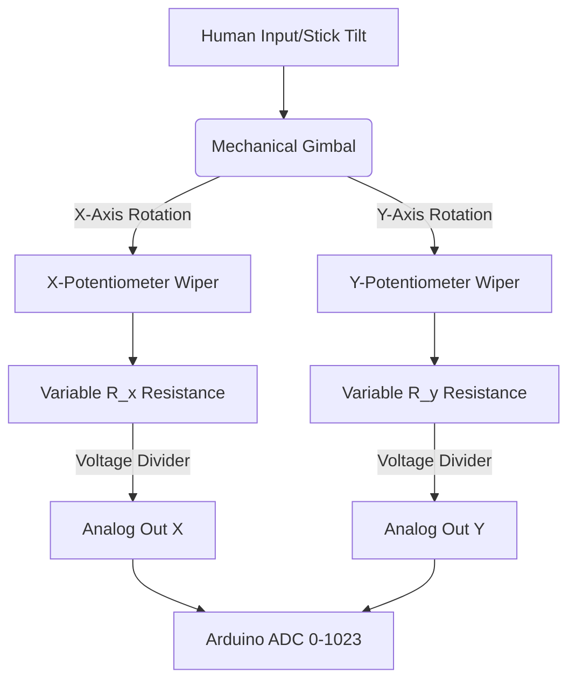

# Joystick Module (Dual-Axis Analog)

## 1. Description
A **Joystick Module** is a dual-axis analog input device, identical to the thumbsticks found on PlayStation or Xbox controllers. 

It provides pure, highly continuous 2D coordinate data (X and Y parameters) based on the physical position of the stick. It also almost always includes a digital push-button (Z-axis) triggered by pressing straight down on the cap.

---

## 2. Theory & Physics

### How it Works (Resistive Voltage Dividers)
The joystick uses two **Rotary Potentiometers** mounted at right angles (X and Y) and a spring-loaded self-centering gimbal.

#### 1. The Resistive Track
- Inside each potentiometer is a horseshoe-shaped **Carbon Resistive Track**.
- A sliding metal contact (the **Wiper**) moves along this track as you push the stick.
- **Voltage Division:** The track acts as a variable voltage divider. The voltage at the Wiper pin depends on its position relative to the 5V and GND terminals.

#### 2. The Cartesian Plane
- **The Gimbal:** A mechanical linkage allows the single stick to rotate two separate wipers simultaneously.
- **Data Mapping:** The horizontal (X) and vertical (Y) components are decoupled physically into two independent analog voltages.

#### Sensing Flow Diagram:


### Logical Signal Path:


---

## 3. Communication Protocol (Analog & Digital)
The module requires three data pins on the Arduino: Two Analog, One Digital.
- **VRx (X Output):** Outputs an analog voltage from 0V to 5V. When perfectly centered, it outputs ~2.5V (which reads as `512` on the Arduino ADC).
- **VRy (Y Output):** Outputs an analog voltage from 0V to 5V. Center is also ~2.5V (`512`).
- **SW (Switch Output):** Outputs a digital HIGH/LOW state when pressed down.

---

## 4. Hardware Wiring (Arduino Mega)

| Joystick Pin | Arduino Mega Pin | Description |
| :--- | :--- | :--- |
| **VCC/5V** | 5V | Powers the potentiometers |
| **GND** | GND | Common Ground |
| **VRx**| Analog Pin A2 | X-Axis continuous voltage |
| **VRy**| Analog Pin A3 | Y-Axis continuous voltage |
| **SW** | Digital Pin (e.g. D7) | The Z-axis click button. *Requires Pull-Up!* |

---

## 5. Arduino Implementation Code

```cpp
#define JOY_X A2
#define JOY_Y A3
#define JOY_BUTTON 7

void setup() {
  Serial.begin(115200);

  // The switch is usually open-circuit, so we rely on the internal pullup
  // to keep it HIGH when unpressed. Pressing it connects to GND (LOW).
  pinMode(JOY_BUTTON, INPUT_PULLUP);
}

void loop() {
  // Read analog voltages (returns a number from 0 to 1023)
  int xVal = analogRead(JOY_X);
  int yVal = analogRead(JOY_Y);
  
  // Read the digital button state
  int buttonState = digitalRead(JOY_BUTTON);

  Serial.print("X: ");
  Serial.print(xVal);
  Serial.print(" | Y: ");
  Serial.print(yVal);
  
  if (buttonState == LOW) {
    Serial.println(" | BUTTON CLICKED!");
  } else {
    Serial.println(" | (unpressed)");
  }

  // To map these to motor speeds or servo angles, use the map() function:
  // int servoX = map(xVal, 0, 1023, 0, 180);

  delay(100); 
}
```

---

## 6. Physical Experiments

1. **The "Center Resting" Map:**
   - **Instruction:** Boot the code without touching the stick. Observe the raw numbers. Then push it hard left, then hard right.
   - **Observation:** At rest, the numbers will likely hover around `500` to `520`, not perfectly zero. Pushing all the way right might hit `1023`, all the way left might hit `0`.
   - **Expected:** The center point of mechanical springs is rarely electrically perfect. This is why all video game software employs a "Deadzone" (ignoring any values between 480 and 540) to prevent characters from slightly walking when you let go of the controller!

---

## 7. Common Mistakes & Troubleshooting

1. **The Button Reada "0" Without Pressing:**
   - *Symptom:* The "BUTTON CLICKED" message prints continuously.
   - *Cause:* The `SW` pin is floating electromagnetically. Your code uses `pinMode(JOY_BUTTON, INPUT);` instead of `INPUT_PULLUP`.
   - *Fix:* Ensure the Arduino is pulling the button pin HIGH (5V) internally.
2. **Only Half the Range Works:**
   - *Symptom:* Moving the stick up and down works, but left and right never changes from 1023.
   - *Cause:* The VRx pin is disconnected or plugged into a digital pin instead of an Analog (A-prefix) pin on the Arduino MEGA.
   - *Fix:* Ensure X and Y are solidly seated in `A0`-`A15` pins.

---

## Required Libraries
This module utilizes built-in analog and digital reading functions. **No external libraries are required.**

---

## AI Assessment Questions (UI Integration)
*The following questions are designed for the interactive UI quiz module to test student comprehension.*

**Q1: What fundamental electronic component creates the X/Y coordinate numbers in an analog joystick?**
- A) An optical camera tracking the stick.
- B) Two physically independent potentiometers (variable resistors) mounted 90 degrees apart. *(Correct)*
- C) A tiny accelerometer chip inside the plastic cap.
- D) Four digital pushbutton switches.

**Q2: When a 5V joystick is resting perfectly centered, what analog ADC reading should the Arduino theoretically report?**
- A) 1023
- B) 0
- C) 512 (approx. 2.5V) *(Correct)*
- D) 255

**Q3: Why is a software "Deadzone" usually required when writing code for a joystick?**
- A) Because the stick can get tired.
- B) Because the mechanical springs rarely return the potentiometers to a mathematically perfect 512/512 center point every time you let go. *(Correct)*
- C) Because the Z-button click requires a delay.
- D) Because the Arduino only reads negative numbers.
