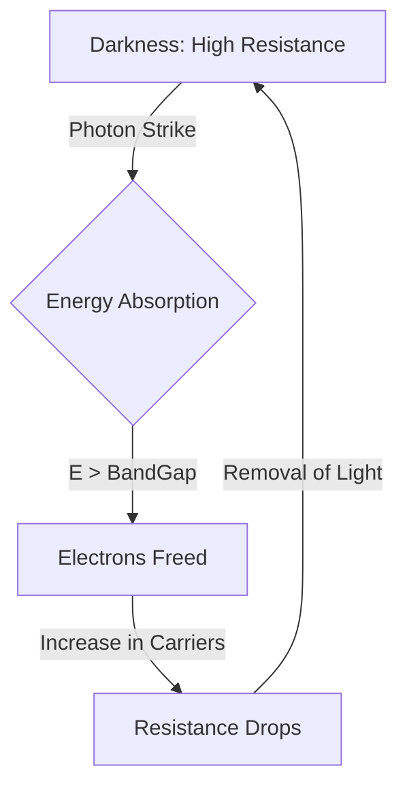
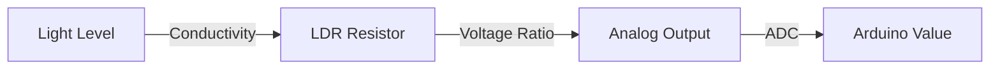

# LDR (Light Dependent Resistor)

## 1. Description
The **LDR (Photoresistor)** is a simple, analog electronic component whose resistance decreases as the intensity of light shining upon it increases. 

It is the standard, ultra-cheap way to give electronics basic "vision" to determine if it is currently day or night. It's universally used in automatic streetlights, nightlights, and simple alarm systems.

---

## 2. Theory & Physics

### How it Works (Photoconductivity)
The LDR is a **passive sensor** made of a semiconductor material—typically **Cadmium Sulfide (CdS)**.

#### 1. The Physics of Photons
- **Dark State:** In darkness, the semiconductor has high resistance because its electrons are locked in the "valence band". There is no energy to push them across the **energy gap** (band gap) into the conduction band.
- **Light Interaction:** When photons (light particles) hit the sensor, they transfer energy to the electrons.
- **Electron Excitation:** If the energy of the photons is greater than the band gap of the CdS, electrons jump to the **conduction band**, creating electron-hole pairs.
- **Result:** The sudden increase in free charge carriers decreases the resistance significantly (**Photoconductivity**).

#### Sensing Flow Diagram:


### Response Spectrum
Not all light triggers the LDR equally. CdS cells are specifically sensitive to wavelengths between **400nm and 600nm** (Blue-Green-Yellow), peaking at 540nm—very similar to the human eye's sensitivity.

#### Logic Flowchart (Voltage Divider):


---

## 3. Communication Protocol (Analog Voltage)
An LDR requires an **Analog** reading. It is physically incapable of digital switching on its own.
- To use an LDR with an Arduino, it must be placed in a **Voltage Divider Circuit** alongside a fixed "pull-down" resistor (typically 10kΩ).
- `Vout = Vin * (R_fixed / (R_LDR + R_fixed))`
- As light increases (R_LDR goes down), the voltage output to the Arduino goes UP.
- The Arduino ADC converts this 0-5V analog voltage into a digital number from 0 to 1023.

*(Note: Sensor modules, rather than bare LDR components, usually have this 10k resistor soldered directly onto the PCB for you).*

---

## 4. Hardware Wiring (Arduino Mega)

| LDR Module Pin | Arduino Mega Pin | Description |
| :--- | :--- | :--- |
| **VCC** | 5V | Power Supply |
| **GND** | GND | Common Ground |
| **AO** | Analog Pin A4 | Analog output for precise light levels |
| DO | Digital Pin (Optional) | Triggers HIGH/LOW based on the blue onboard potentiometer |

---

## 5. Arduino Implementation Code

```cpp
#define LDR_PIN A4

void setup() {
  Serial.begin(115200);
  Serial.println("Light Sensor Initialized.");
}

void loop() {
  // Read the analog value (0-1023)
  int lightLevel = analogRead(LDR_PIN);

  Serial.print("Raw Light Value: ");
  Serial.print(lightLevel);

  // Broad categorization
  if (lightLevel < 50) {
    Serial.println(" - Pitch Black Night");
  } else if (lightLevel < 400) {
    Serial.println(" - Dimly Lit Room");
  } else if (lightLevel < 800) {
    Serial.println(" - Bright Office");
  } else {
    Serial.println(" - Direct Flashlight / Sunlight");
  }

  // To map it to an automatic LED brightness (0-255 PWM):
  // We invert it so the LED gets BRIGHTER when the room gets DARKER.
  // int pwmValue = map(lightLevel, 0, 1023, 255, 0);

  delay(250);
}
```

---

## 6. Physical Experiments

1. **The Shadow Test:**
   - **Instruction:** Hold your hand directly over the sensor so it casts a solid shadow, but don't touch it. Then remove your hand.
   - **Observation:** Notice the analog numbers drop smoothly when the shadow falls over it and rise when the light returns.
   - **Expected:** Unlike digital IR sensors that use reflection, this strictly measures ambient energy.
2. **The Color Response Test:**
   - **Instruction:** Shine a red light (from a phone screen or LED) onto the LDR and note the peak value. Then shine a blue light of equal brightness.
   - **Observation:** The LDR will likely react much better to the Red/Yellow light than the Blue light.
   - **Expected:** Cadmium Sulfide (CdS) LDRs do not see all colors equally! Their spectral response curve heavily favors Green-Yellow-Red (500nm - 600nm) and they are nearly blind to deep blue or UV light.

---

## 7. Common Mistakes & Troubleshooting

1. **Bare Component Missing Resistor:**
   - *Symptom:* The analog input randomly floats around 300, or always reads 1023 regardless of light.
   - *Cause:* You plugged a raw 2-leg LDR directly between 5V and A0 without a 10k resistor to GND. You didn't create a voltage divider!
   - *Fix:* Ensure a 10k resistor links the A0 pin physically to the GND rail.
2. **Slow Response Time:**
   - *Symptom:* It takes almost a full second for the reading to drop back down to zero after turning off a flashlight.
   - *Cause:* LDR "Latency". CdS cells are notoriously slow to shed their electrons and regain their resistance after exposure to bright light.
   - *Fix:* This is an unavoidable physics limitation of the material. For high-speed optical applications (like measuring the flicker of a monitor), a **Photodiode** must be used instead.

---

## Required Libraries
This analog sensor requires no digital protocol. **No external libraries are required.**

---

## AI Assessment Questions (UI Integration)
*The following questions are designed for the interactive UI quiz module to test student comprehension.*

**Q1: How does the electrical resistance of an LDR change in response to light?**
- A) Resistance increases as light intensity increases.
- B) Resistance drops massively when exposed to bright light. *(Correct)*
- C) Resistance remains constant, but the voltage source changes.
- D) It generates its own voltage in response to light.

**Q2: Since an LDR cannot trigger a HIGH/LOW digital state on its own, what type of circuit must it be wired into to work with an Arduino?**
- A) An H-Bridge
- B) A voltage divider circuit with a fixed pull-down resistor. *(Correct)*
- C) A Schmitt Trigger
- D) An Operational Amplifier

**Q3: Which color of light will a standard Cadmium Sulfide (CdS) LDR struggle to detect?**
- A) Red light
- B) Deep Blue or Violet/UV light *(Correct)*
- C) Yellow light
- D) Green light
