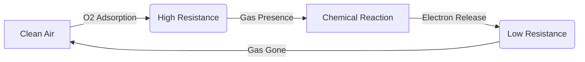
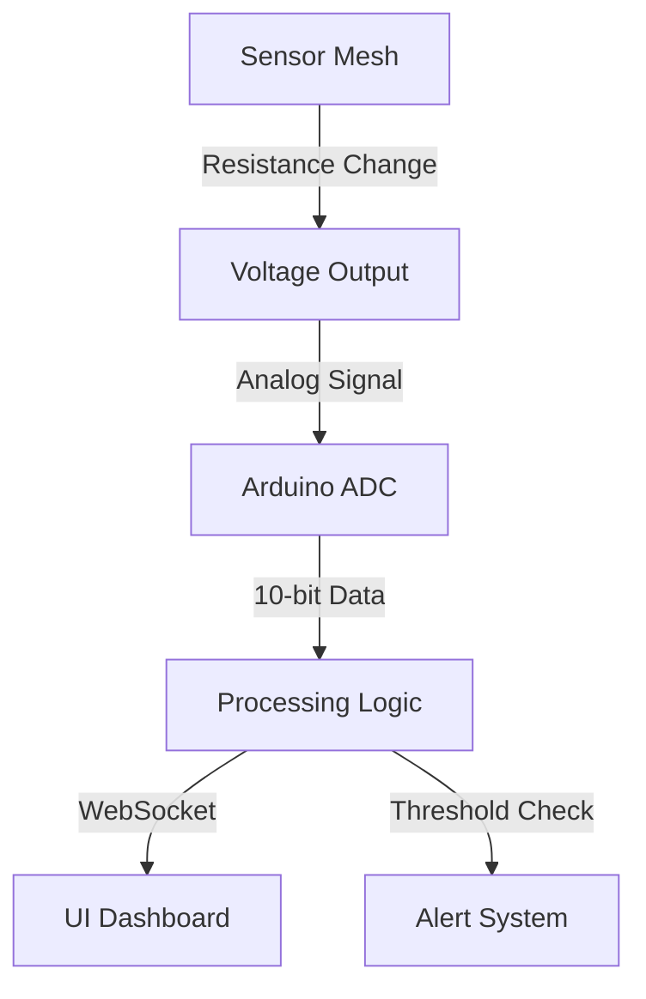

# MQ-2 Combustible Gas and Smoke Sensor

## 1. Description
The **MQ-2** is an analog gas sensor that is highly sensitive to LPG, i-butane, propane, methane, alcohol, hydrogen, and smoke. It is commonly used in gas leakage detecting equipment in family and industry. 

It contains a small heating element (which gets physically warm!) necessary for the chemical sensing reaction to occur.

---

## 2. Theory & Physics

### Physical Sensing Mechanism
The MQ-2's operation is based on the **solid-state gas sensor** principle.

#### Sensing State Diagram:


### Detailed Physics (Chemisorption)
1. **Atoms and Electrons:** Inside the sensor, a ceramic tube is coated with **Tin Dioxide (SnO₂)**. In clean air, oxygen atoms from the atmosphere gain electrons from the SnO₂ surface and become negatively charged (O⁻ or O²⁻).
2. **The Barrier:** This "theft" of electrons creates a depletion layer, forming a potential barrier that prevents electricity from flowing easily. This is why the sensor has **high resistance** in normal air.
3. **The Chemical Reaction:** When a combustible gas (like Butane or Smoke) touches the surface, it reacts with the adsorbed oxygen ions. For example: `CH4 + 4O⁻ -> CO2 + 2H2O + 4e⁻`.
4. **Result:** The reaction releases the electrons back into the semiconductor's conduction band. The potential barrier collapses, and the material becomes much more conductive (**low resistance**).

#### Logic Flowchart:


---

## 3. Communication Protocol (Analog Voltage)
Unlike I2C sensors, the MQ-2 is primarily an **Analog** sensor.
- The module forms a simple voltage divider circuit with the SnO2 variable resistor and a load resistor (RL).
- As gas concentration goes up, resistance goes down, meaning the analog output voltage goes UP.
- The Arduino reads this via its built-in Analog-to-Digital Converter (ADC) from 0 to 1023.
- (Many modules also include a Digital OUT (DO) pin, which uses an onboard LM393 comparator to trigger HIGH/LOW at a certain threshold calibrated by a potentiometer screw).

---

## 4. Hardware Wiring (Arduino Mega)

| MQ-2 Pin | Arduino Mega Pin | Description |
| :--- | :--- | :--- |
| **VCC** | 5V | *Requires 5V to power the heating element* |
| **GND** | GND | Common Ground |
| **A0** | Analog Pin A0 | Analog output (0V to 5V) |
| DO | Digital Pin (Optional) | Digital threshold trigger |

---

## 5. Arduino Implementation Code

```cpp
#define MQ2_PIN A0 

void setup() {
  Serial.begin(115200);
  Serial.println("MQ-2 Warm-up initialized...");
  // The heater needs ~24 hours of burn-in for perfect accuracy,
  // but for basic changes, a few minutes is enough.
}

void loop() {
  // Read the analog value (0-1023 corresponding to 0-5V)
  int rawValue = analogRead(MQ2_PIN);

  // Convert raw reading to an approximate voltage
  float voltage = rawValue * (5.0 / 1023.0);

  Serial.print("Raw ADC: ");
  Serial.print(rawValue);
  Serial.print(" | Voltage: ");
  Serial.print(voltage);
  Serial.println("V");

  // Simple alarm logic
  if(rawValue > 400) {
    Serial.println("WARNING: HIGH GAS/SMOKE DETECTED!");
  }
  
  delay(1000);
}
```

---

## 6. Physical Experiments

1. **The Lighter Protocol (Be Careful!):**
   - **Instruction:** Press the button on a standard butane lighter *without* striking the flint so only unlit gas escapes. Hold it 2cm from the metal mesh for 2 seconds.
   - **Observation:** The analog reading will immediately spike from ~150 to over 600+.
   - **Expected:** Proves the SnO2 layer is reacting to the butane gas. Removing the lighter will slowly return the status to baseline as the gas dissipates.

2. **The "Warm Up" Observation:**
   - **Instruction:** Touch the metal mesh case lightly with a finger 5 minutes after powering on.
   - **Observation:** The metal case will be distinctly warm/hot to the touch.
   - **Expected:** The internal heating coil draws around 150mA to keep the ceramic core at operating temperature.

---

## 7. Common Mistakes & Troubleshooting

1. **Inaccurate "Absolute" PPM Readings:**
   - *Symptom:* Students try to convert the 0-1023 number directly to Parts Per Million (PPM) but get crazy numbers.
   - *Cause:* The MQ-2 is non-linear and extremely sensitive to ambient temperature and humidity. 
   - *Fix:* Use it relatively (e.g., "Baseline is 100, Warning is 400") or perform complex logarithmic mathematical curves calibrated against a known gas concentration.
2. **Sensor Drifts Down Over Hours:**
   - *Cause:* "Burn-in". Brand new sensors have moisture and impurities on the SnO2. 
   - *Fix:* Leave it powered on 5V for 24-48 hours continuously to bake off impurities.

---

## Required Libraries
This sensor uses raw internal ADC polling. **No external libraries are required.**

---

## AI Assessment Questions (UI Integration)
*The following questions are designed for the interactive UI quiz module to test student comprehension.*

**Q1: Why does the MQ-2 sensor get physically hot when powered on?**
- A) Because the Arduino is supplying too much voltage.
- B) It contains an internal heater required to trigger the chemical reaction with combustible gases. *(Correct)*
- C) It is short-circuiting.
- D) To boil the humidity out of the air.

**Q2: What type of electrical element changes its property based on gas concentration in the MQ-2?**
- A) A Photodiode
- B) A Piezoelectric crystal
- C) A Tin Dioxide (SnO₂) sensing resistor *(Correct)*
- D) A Hall Effect transistor

**Q3: Why is an analog-to-digital converter (ADC) needed for this sensor?**
- A) Because it communicates over I²C.
- B) Because its output is a fluctuating continuous voltage, not a simple 1 or 0. *(Correct)*
- C) Because the sensor requires 5V logic.
- D) To convert the digital data into a radio frequency.
