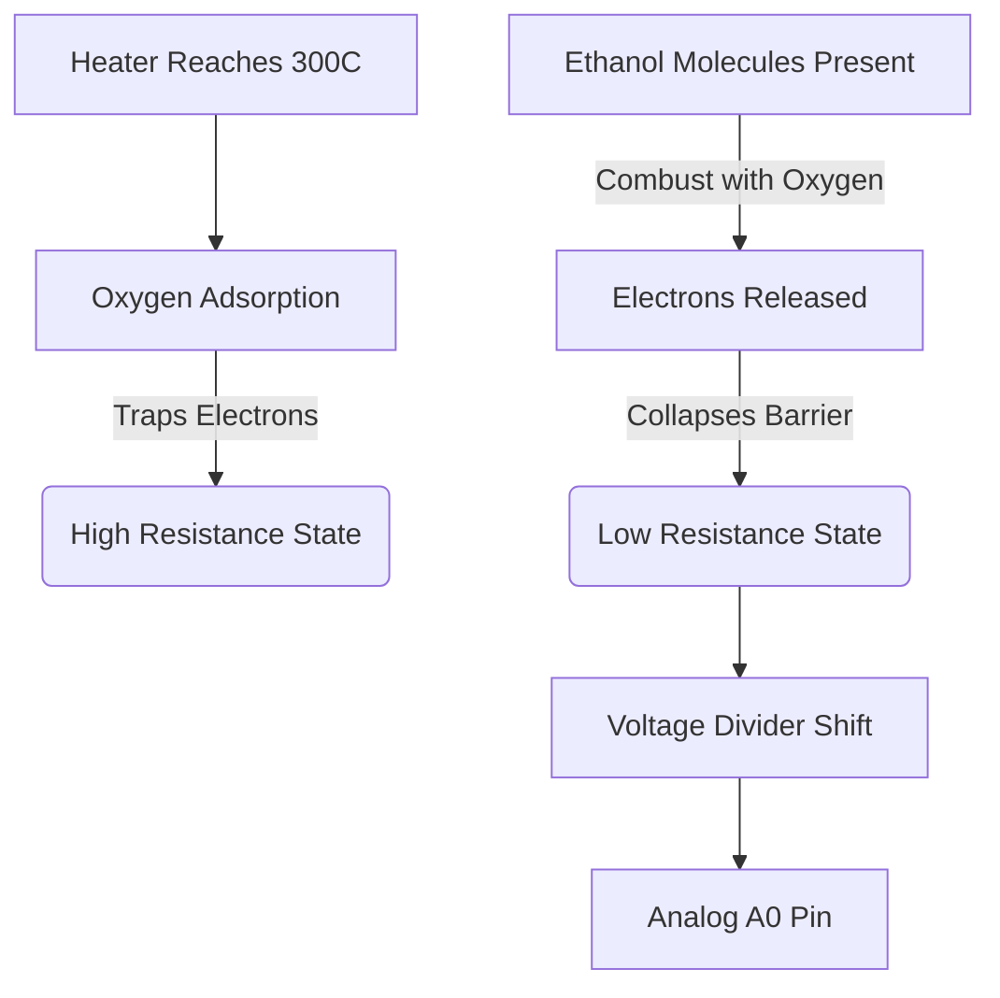

# MQ-3 Alcohol Vapor Sensor

## 1. Description
The **MQ-3** is a semiconductor gas sensor highly sensitive to **alcohol (ethanol)** vapor. It is commonly used in breathalyzer prototypes and intoxication detection systems. It has a lower sensitivity to Benzene and very low sensitivity to Smoke/LPG (the opposite of the MQ-2).

Like the MQ-2, it relies on a heating element to facilitate a chemical reaction on a ceramic core.

---

## 2. Theory & Physics

### How it Works (Surface Oxygen Depletion)
The MQ-3 is a **Chemiresistor** sensor that detects ethanol ($C_2H_5OH$) molecules.

#### 1. Pre-heating State
- The internal Ni-Cr heater keeps the **Tin Dioxide (SnO₂)** semiconductor layer at approx. 300°C.
- At this temperature, oxygen molecules ($O_2$) from the air are adsorbed onto the SnO2 surface.
- These oxygen atoms take electrons from the SnO2, forming $O^-$ or $O^{2-}$ ions. This creates a **potential barrier** (depletion region), leading to **high resistance**.

#### 2. Alcohol Interaction
- When alcohol vapor ($C_2H_5OH$) touches the surface, it reacts with the oxygen ions.
- **The Redox Reaction:** $C_2H_5OH + 6O^- \rightarrow 2CO_2 + 3H_2O + 6e^-$.
- This reaction releases the trapped electrons back into the SnO2 conduction band.
- **The Result:** The depletion region collapses, and the material's resistance drops significantly (**increase in conductivity**).

#### Sensing Flow Diagram:


### Signal Logic (Calibration):


---

## 3. Communication Protocol (Analog Voltage)
The MQ-3 acts as an analog voltage divider.
- Outputs 0 to 5V relative to ethanol concentration.
- Read via Arduino ADC (`analogRead(A0)` turning 0-5V into 0-1023).

---

## 4. Hardware Wiring (Arduino Mega)

| MQ-3 Pin | Arduino Mega Pin | Description |
| :--- | :--- | :--- |
| **VCC** | 5V | *Provides power to the heater. Do not use 3.3V* |
| **GND** | GND | Common Ground |
| **A0** | Analog Pin A1 | Analog output indicating alcohol concentration |
| DO | Digital Pin (Optional) | Threshold trigger (adjust via blue potentiometer) |

---

## 5. Arduino Implementation Code

```cpp
#define MQ3_PIN A1

void setup() {
  Serial.begin(115200);
  Serial.println("MQ-3 Breathalyzer Initializing...");
  // Requires warm-up time for the heater
}

void loop() {
  int alcoholVal = analogRead(MQ3_PIN);
  float voltage = alcoholVal * (5.0 / 1023.0);

  Serial.print("Raw: ");
  Serial.print(alcoholVal);
  Serial.print(" | Volts: ");
  Serial.print(voltage);
  
  // Basic breathalyzer logic (Thresholds require calibration!)
  if (alcoholVal < 300) {
    Serial.println(" - Air is Clean");
  } else if (alcoholVal < 600) {
    Serial.println(" - Mild Alcohol Detected");
  } else {
    Serial.println(" - HIGH ALCOHOL CONTENT (Drunk!)");
  }

  delay(500);
}
```

---

## 6. Physical Experiments

1. **The Hand Sanitizer Test:**
   - **Instruction:** Rub a small amount of alcohol-based hand sanitizer or rubbing alcohol on your hands. Cup your hands around the sensor and exhale into them (or just hold them near).
   - **Observation:** The analog reading should spike violently towards 800-1023.
   - **Expected:** Confirms the sensor's extreme sensitivity to ethanol vapors. It will take a few minutes for the sensor to "recover" and drop back to baseline once the alcohol evaporates.

---

## 7. Common Mistakes & Troubleshooting

1. **Using it immediately after turning on:**
   - *Cause:* The heater hasn't reached operating temperature.
   - *Fix:* Wait at least 3-5 minutes before taking the first test reading.
2. **False Positives with Breath:**
   - *Cause:* Human breath is warm and humid. The MQ-3 is slightly cross-sensitive to water vapor and heat.
   - *Fix:* Read the baseline value in a humid environment first. Only large spikes (e.g. going from 200 to 500) indicate alcohol. Small bumps (from 150 to 180) are just moisture/heat from exhaling.

---

## Required Libraries
This sensor uses raw internal ADC polling. **No external libraries are required.**

---

## AI Assessment Questions (UI Integration)
*The following questions are designed for the interactive UI quiz module to test student comprehension.*

**Q1: What specific gas configuration is the MQ-3 optimized to detect?**
- A) Methane
- B) Alcohol / Ethanol *(Correct)*
- C) Carbon Monoxide
- D) Hydrogen Gas

**Q2: How does the MQ-3 communicate its gas readings to the microcontroller?**
- A) As an analog voltage ranging from 0 to 5 Volts. *(Correct)*
- B) via an I²C bus.
- C) via a Single-Wire Digital protocol.
- D) By transmitting ultrasonic pulses.

**Q3: Why might blowing gently on the MQ-3 cause a false positive?**
- A) Because the sensor is broken.
- B) Because human breath is warm and humid, and the sensor is slightly sensitive to temperature and moisture. *(Correct)*
- C) Because the microcontroller lacks power.
- D) Because the I²C address changed.
