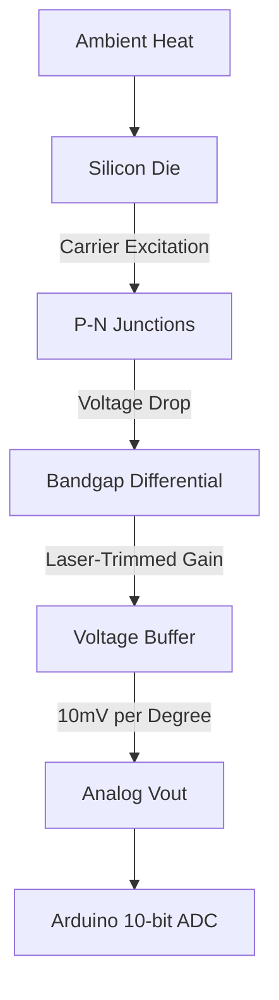

# LM35 Analog Temperature Sensor

## 1. Description
The **LM35** is a ubiquitous, precision integrated-circuit temperature sensor. Unlike a thermistor which outputs non-linear resistance, the LM35 outputs an analog voltage that is exactly proportional to the Centigrade (Celsius) temperature.

It comes in a tiny, 3-pin package (looks like a standard transistor) and does not require any external calibration or complex libraries to use. It is accurate to ±0.5°C at room temperature.

> [!NOTE]
> While the LM35 and Thermistor provide excellent analog theory, the **Virtual Lab's primary temperature node** uses the digital **DHT11 (Pin 2)** for integrated Humidity/Temp telemetry. Apply the logic below if using an optional analog probe.

---

## 2. Theory & Physics

### How it Works (Bandgap Voltage Reference)
The LM35 is an **Integrated Circuit (IC)** sensor that uses the physical properties of silicon transistors to measure temperature.

#### 1. The P-N Junction Effect
- The sensor exploits the temperature dependence of a semiconductor's **P-N junction**.
- The base-emitter voltage ($V_{be}$) of a bipolar junction transistor (BJT) varies linearly with temperature.
- In silicon, this voltage decreases by approximately **-2.2mV per degree Celsius**.

#### 2. The Bandgap Regulator
- Inside the LM35, two transistors are operated at different current densities.
- The difference in their $V_{be}$ is perfectly proportional to **Absolute Temperature (PTAT)**.
- Internal precision-trimmed resistors amplify this tiny difference to exactly **10mV/°C**.

#### Sensing Flow Diagram:


### Linear Mapping Logic:


---

## 3. Communication Protocol (Analog Voltage)
Because the LM35 does all the hard math in hardware, the communication is a simple, direct Analog reading.
- At 0°C, it outputs 0.0V (0 mV).
- At 25°C, it outputs 0.25V (250 mV).
- At 100°C, it outputs 1.0V (1000 mV).
- We use the Arduino's 10-bit Analog-to-Digital Converter (ADC) to read this voltage and turn it back into degrees.

---

## 4. Hardware Wiring (Arduino Mega)

| LM35 Pin (Flat Side Facing You) | Arduino Mega Pin | Description |
| :--- | :--- | :--- |
| **Left Pin (VCC)** | 5V | Operates anywhere from 4V to 30V |
| **Middle Pin (VOUT)** | Analog Pin A7 | Analog voltage output |
| **Right Pin (GND)** | GND | Common Ground |

---

## 5. Arduino Implementation Code

No external library is required! 

```cpp
#define TEMP_PIN A7

void setup() {
  Serial.begin(115200);
  Serial.println("LM35 Temperature Probe Online.");
}

void loop() {
  // Read the 10-bit ADC value (0 - 1023)
  int rawADC = analogRead(TEMP_PIN);

  // 1. Convert the ADC number to an actual voltage (in millivolts).
  // The Arduino Mega ADC runs at 5.0V (5000mV) resolution across 1024 steps.
  float millivolts = (rawADC / 1024.0) * 5000.0;

  // 2. The LM35 scale factor is 10mV per degree Celsius.
  float tempC = millivolts / 10.0;
  
  // 3. (Optional) Convert to Fahrenheit
  float tempF = (tempC * 9.0 / 5.0) + 32.0;

  Serial.print("Raw ADC: ");
  Serial.print(rawADC);
  Serial.print(" | Temp: ");
  Serial.print(tempC);
  Serial.print(" °C  /  ");
  Serial.print(tempF);
  Serial.println(" °F");

  delay(1000); 
}
```

---

## 6. Physical Experiments

1. **The Human Body Test:**
   - **Instruction:** Read the room temperature. Then gently squeeze the black plastic casing of the LM35 firmly between your thumb and index finger for 30 seconds.
   - **Observation:** Watch the temperature rise rapidly and then plateau around 34°C - 36°C.
   - **Expected:** Normal outer skin temperature is slightly cooler than core body temp (37°C). Because the sensor draws only 60 microamps, it does not self-heat, meaning it accurately measures the exact temperature of whatever touches its plastic casing.

---

## 7. Common Mistakes & Troubleshooting

1. **Wiring Backwards (Instant Burnout):**
   - *Symptom:* The moment you plug in the Arduino, the LM35 gets so incredibly hot it burns your finger to the touch and releases smoke.
   - *Cause:* Flipping VCC and GND. Because the casing is symmetric but the pins are not, it is statistically the most frequently backwards-wired component in all of electronics.
   - *Fix:* Look at the flat face with the writing on it. Left is 5V. Right is GND. If you wired it backwards and it burned, throw it away—the silicon die is permanently destroyed.
2. **Jitter / Fluctuating Numbers:**
   - *Symptom:* The temperature reads 24.1, then 26.5, then 23.9 rapidly.
   - *Cause:* The Arduino's 5V power supply from the USB port is noisy. Since the LM35 only outputs 240mV at room temp, even a 20mV ripple on the Arduino's 5V rail heavily distorts the ADC math.
   - *Fix:* Use the Arduino's internal 1.1V Analog Reference (`analogReference(INTERNAL1V1);` on Mega) for much higher ADC precision, or add a capacitor across the sensor pins.

---

## Required Libraries
This sensor outputs purely analog voltage. **No external libraries are required.**

---

## AI Assessment Questions (UI Integration)
*The following questions are designed for the interactive UI quiz module to test student comprehension.*

**Q1: How does the LM35 differ fundamentally from a standard NTC thermistor?**
- A) It measures humidity as well.
- B) It outputs a perfectly linear analog voltage based on temperature instead of a non-linear resistance curve. *(Correct)*
- C) It requires an I²C bus.
- D) It generates its own heat.

**Q2: What is the exact scale factor that the factory-trimmed LM35 uses to output its readings?**
- A) 1 Volt per degree Celsius.
- B) 10 millivolts (0.01V) per degree Fahrenheit.
- C) 10 millivolts (0.01V) per degree Celsius. *(Correct)*
- D) 500 millivolts per bit.

**Q3: What is the most statistically likely reason an LM35 would instantly burst into smoke upon powering up?**
- A) Using too high of a `delay()` in the code.
- B) The ambient room temperature is over 150°C.
- C) Wiring the VCC and GND pins backward, shorting out the internal silicon die. *(Correct)*
- D) Touching it with your finger while it is reading.
