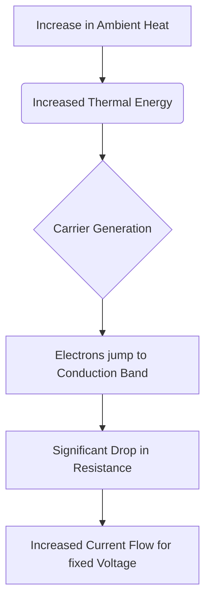

# NTC Thermistor (Temperature Sensor)

## 1. Description
A **Thermistor** (Thermal Resistor) is a type of resistor whose resistance is dependent on temperature. The term is a portmanteau of "thermal" and "resistor".

In this lab, we use an **NTC** (Negative Temperature Coefficient) thermistor, meaning the resistance **decreases** as the temperature **increases**. They are preferred for temperature measurement because they are extremely sensitive to small changes in temperature.

---

## 2. Theory & Physics

### How it Works (Semiconductor Carriers)
- Unlike metals (which have a PTC), NTC thermistors are made of sintered semiconductor materials (metal oxides).
- **At Low Temperatures:** The valence electrons are mostly bound to the lattice. There are few charge carriers available, resulting in **high resistance**.
- **As Temperature Rises:** Thermal energy provides enough excitement for electrons to jump into the conduction band or create "holes". 
- The exponential increase in the number of charge carriers leads to a drastic **drop in resistance**.

### Physical Mechanism Flowchart


### The Steinhart-Hart Equation
The relationship between resistance and temperature is non-linear and follows the Steinhart-Hart model:
`1/T = A + B*ln(R) + C*(ln(R))^3`
Where:
- `T` is temperature in Kelvin.
- `R` is resistance in Ohms.
- `A, B, C` are specific constants for the thermistor.

---

## 3. Communication Protocol (Analog Voltage)
Thermistors are passive components and require a **Voltage Divider** to be read by the Arduino.
- Typically paired with a 10kΩ fixed resistor.
- The output voltage (V_out) is proportional to the resistance change.
- The Arduino ADC converts this into a 10-bit digital value.

---

## 4. Hardware Wiring (Arduino Mega)

| Pin | Connection |
| :--- | :--- |
| **VCC** | 5V |
| **GND** | GND |
| **Data** | Analog Pin A7 |

---

## 5. Arduino Implementation Code
```cpp
#include <math.h>

const int thermistorPin = A7;

double Thermistor(int RawADC) {
  double Temp;
  Temp = log(10000.0 * ((1024.0 / RawADC - 1))); 
  Temp = 1 / (0.001129148 + (0.000234125 + (0.0000000876741 * Temp * Temp )) * Temp );
  Temp = Temp - 273.15; // Convert Kelvin to Celsius
  return Temp;
}

void setup() {
  Serial.begin(115200);
}

void loop() {
  int val = analogRead(thermistorPin);
  double celsius = Thermistor(val);
  Serial.print("Temp: ");
  Serial.println(celsius);
  delay(1000);
}
```

---

## 6. Physical Experiments

1. **The Body Heat Response:**
   - **Instruction:** Pinch the black bead of the thermistor between your thumb and index finger for 10 seconds.
   - **Expected:** Temperature should rise from room temperature (~25°C) to near body temperature (~32-35°C on skin surface).

2. **Flowchart: Measurement Logic**


---

## 7. Common Mistakes & Troubleshooting
- **Incorrect Calculation:** Using a 5k resistor with a 10k thermistor without updating the formula.
- **Self-Heating:** If current is too high, the thermistor will heat itself up, causing an "offset" error. Always use at least a 10k fixed resistor to limit current.

---

## AI Assessment Questions (UI Integration)
*The following questions are designed for the interactive UI quiz module to test student comprehension.*

**Q1: What happens to the resistance of an NTC thermistor as the temperature increases?**
- A) It increases proportionally
- B) It remains constant
- C) It decreases exponentially *(Correct)*
- D) It fluctuates randomly

**Q2: Which mathematical equation is commonly used to convert thermistor resistance to temperature?**
- A) Ohm's Law
- B) Steinhart-Hart Equation *(Correct)*
- C) Planck's Law
- D) Fourier Transform

**Q3: Why must a thermistor typically be used in a voltage divider circuit with an Arduino?**
- A) To amplify the ambient temperature signal
- B) To convert resistance changes into measurable voltage changes *(Correct)*
- C) To power the semiconductor lattice directly
- D) To prevent the sensor from freezing at low temperatures

