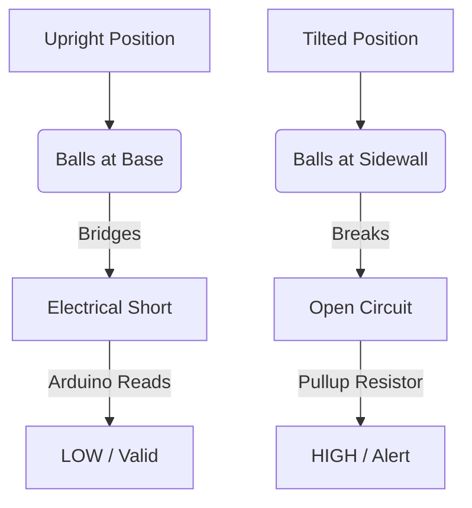

# Tilt / Vibration Sensor (e.g. SW-520D)

## 1. Description
A **Tilt Sensor** (often a ball switch or mercury switch) is a component that can detect basic orientation or inclination. It essentially acts like a mechanical button that presses itself when you rotate the device. 

In IoT, they are heavily used for simple mechanical safety cutoffs (like a space heater turning off if knocked over) or rudimentary vibration detection (like an anti-theft box alarm).

---

## 2. Theory & Physics

### How it Works (Conductive Ball Bridging)
The tilt sensor (specifically the non-mercury SW-520D) is a **passive mechanical switch** that uses gravity to operate.

#### 1. Mechanical Componentry
- **The Cylinder:** A sealed metal or plastic housing.
- **The Contacts:** Two distinct conductive legs that enter the chamber but do not touch each other.
- **The Pellets:** Two tiny, solid metal balls (plated with gold or silver to prevent oxidization).

#### 2. Gravity-Induced Switching
- **Vertical Orientation:** When the sensor points "head up", gravity forces the balls to the bottom of the cylinder. They physically rest against both contacts, bridging the electrical gap.
- **Tilted Orientation:** When moved past the "Trigger Angle" (approx. 45°), the balls roll down the sidewall and away from the contacts. This instantly breaks the electrical path.

#### Sensing Flow Diagram:


### Physical Mechanism Summary:


---

## 3. Communication Protocol (Digital Output)
The tilt sensor is a purely mechanical switch.
- It outputs **HIGH** (or LOW) depending on whether the internal balls are bridging the circuit.
- Similar to standard pushbuttons, it requires a Pull-Up or Pull-Down resistor in the circuit to explicitly set the voltage level when the circuit is open. The Arduino's built-in `INPUT_PULLUP` is perfect for this.

---

## 4. Hardware Wiring (Arduino Mega)

| Tilt Sensor Pin | Arduino Mega Pin | Description |
| :--- | :--- | :--- |
| **Leg 1** | Digital Pin (e.g. D12) | Connected to Arduino for reading the state |
| **Leg 2** | GND | Connected directly to common ground |

*Note: Since it acts as a simple mechanical switch connecting to ground, we rely on the Arduino's internal pull-up resistor (5V) tied to D3 to complete the circuit logic.*

---

## 5. Arduino Implementation Code

```cpp
#define TILT_PIN 12

void setup() {
  Serial.begin(115200);

  // Initialize the pin using the internal pull-up resistor.
  // When the switch is OPEN (tilted), the pin will read HIGH.
  // When the switch is CLOSED (upright), the pin is pulled to GND and reads LOW.
  pinMode(TILT_PIN, INPUT_PULLUP);
}

void loop() {
  int tiltState = digitalRead(TILT_PIN);

  if (tiltState == LOW) {
    Serial.println("Status: Upright (Safe)");
  } else {
    Serial.println("WARNING: DEVICE TILTED!");
  }

  // Very fast polling is useful for vibration detection
  delay(10); 
}
```

---

## 6. Physical Experiments

1. **The Vibration / Shake Alarm:**
   - **Instruction:** Hold the sensor perfectly upright. Flick it hard with your finger, or place it on a desk and hit the desk.
   - **Observation:** You will see a flurry of "DEVICE TILTED!" and "Upright" messages spamming the serial monitor.
   - **Expected:** The sudden kinetic force overcomes gravity, momentarily bouncing the metal ball off the contacts ("switch bounce"). This proves a simple ball-tilt sensor can double as a crude seismic or tamper vibration alarm.

---

## 7. Common Mistakes & Troubleshooting

1. **Constant HIGH/LOW Output Flapping:**
   - *Symptom:* The sensor never definitively settles on upright or tilted when trying to rest it in a breadboard.
   - *Cause:* The sensor is physically wobbling, or it wasn't mounted vertically straight.
   - *Fix:* The sensor relies purely on gravity. It must be soldered or taped completely perpendicular or completely parallel to the object it is protecting.
2. **Missing Pull-Up Resistor (Floating Pin):**
   - *Symptom:* If not using `INPUT_PULLUP`, the pin reads random 0s and 1s wildly when tilted open.
   - *Cause:* When the ball rolls away, the Arduino pin is connected to absolutely nothing ("floating") and picks up random electromagnetic noise from the room.
   - *Fix:* Ensure your code says `INPUT_PULLUP` or physically wire a 10k resistor from the reading pin to 5V.

---

## Required Libraries
This sensor acts as a purely mechanical switch. **No external libraries are required.**

---

## AI Assessment Questions (UI Integration)
*The following questions are designed for the interactive UI quiz module to test student comprehension.*

**Q1: What internal mechanism bridges the circuit in a standard SW-520D Tilt Sensor?**
- A) A flexible piezoelectric crystal.
- B) A droplet of mercury or solid conductive metal balls. *(Correct)*
- C) Dual phototransistors.
- D) A hall-effect magnetic plate.

**Q2: Why is `INPUT_PULLUP` necessary in the code for a basic tilt switch?**
- A) It prevents the Arduino from pulling too much current and exploding.
- B) It keeps the input pin definitively HIGH so that the circuit doesn't float and read random static when the switch opens. *(Correct)*
- C) It pulls the metal balls faster via magnetism.
- D) It increases the sensitivity angle.

**Q3: Besides orientation (upright vs sideways), what other event can this simple sensor easily detect via "switch bounce"?**
- A) Temperature changes.
- B) Changes in air pressure.
- C) Sudden kinetic impacts or vibrations. *(Correct)*
- D) Humidity levels.
