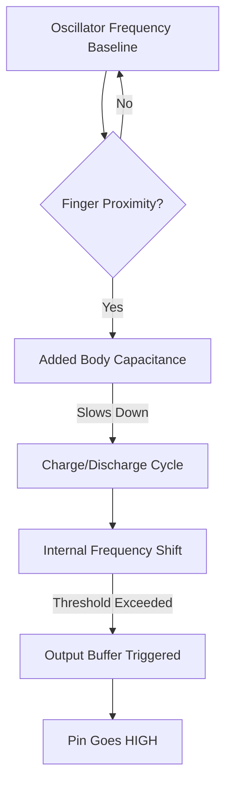
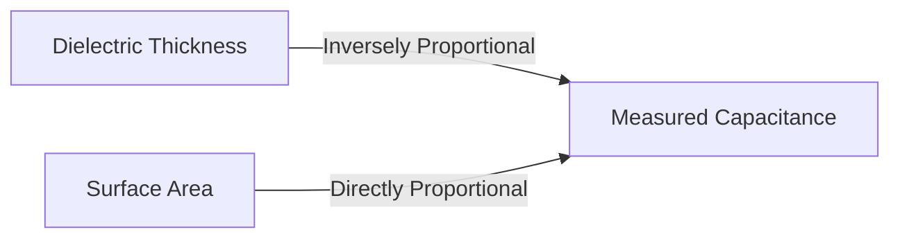

# Capacitive Touch Sensor (e.g., TTP223)

## 1. Description
The **Capacitive Touch Sensor** is essentially a digital button that reacts to the touch of a human finger without requiring any physical moving parts. They are used extensively to replace physical tactile buttons on appliances, smartphones, and smart mirrors because they are wear-proof, easy to clean, and can be hidden entirely behind a layer of glass or plastic.

---

## 2. Theory & Physics

### How it Works (Parasitic Capacitance)
The Touch sensor operates on the principle of **Capacitive Displacement Sensing**.

#### 1. The Capacitor System
- **The Pad:** The sensor features a copper pad connected to the sensing pin of the IC (e.g., TTP223).
- **The Baseline:** The IC continuously calculates the capacitance between the copper pad and the ground plane.
- **The Human Capacitor:** The human body is a large reservoir of charge carriers. When your finger approaches the pad, it acts as a **conductive plate**, forming a parallel-plate capacitor with the copper pad.

#### Sensing Flow Diagram:


### The Physics of Dielectrics
The sensor can detect touch through non-conductive barriers (like 5mm of glass) because the **Electric Field** lines can penetrate through insulating Materials.

#### Capacitance Relationship:

`C = (ε₀ * εᵣ * A) / d`
where `εᵣ` is the dielectric constant of the material covering the sensor (e.g., Acrylic ≈ 3.2).

---

## 3. Communication Protocol (Digital Output)
The sensor acts identically to a standard tactile pushbutton.
- Outputs **HIGH** while touched.
- Outputs **LOW** when untouched.

---

## 4. Hardware Wiring (Arduino Mega)

| Touch Pin | Arduino Mega Pin | Description |
| :--- | :--- | :--- |
| **VCC** | 5V or 3.3V | Power Supply |
| **GND** | GND | Common Ground |
| **SIG/I/O**| Digital Pin (e.g. D5) | Output signal to Arduino |

---

## 5. Arduino Implementation Code

```cpp
#define TOUCH_PIN 5

void setup() {
  Serial.begin(115200);
  
  // The onboard chip handles the pull-down logic, so standard INPUT is fine
  pinMode(TOUCH_PIN, INPUT);
}

void loop() {
  int touchState = digitalRead(TOUCH_PIN);

  if (touchState == HIGH) {
    Serial.println("Finger detected. BOOP!");
    
    // Add a small debounce delay so it doesn't spam 10,000 times a second
    delay(250); 
  }

  // Fast loop to ensure responsiveness
  delay(10); 
}
```

---

## 6. Physical Experiments

1. **The Hidden Switch Test (Dielectric Penetration):**
   - **Instruction:** Place a piece of standard printer paper over the copper face of the sensor. Touch the paper directly above the sensor. Note if it triggers. Now try a thick piece of cardboard. Now try a piece of thin glass or acrylic.
   - **Observation:** The sensor should successfully detect your finger straight through the paper and glass, but might fail on the thick cardboard.
   - **Expected:** Because capacitance is based on the electric field, it can penetrate non-conductive materials (dielectrics). This is exactly how your smartphone screen works, despite having a thick layer of Gorilla Glass over the sensing grid!

---

## 7. Common Mistakes & Troubleshooting

1. **False Positives in Damp Environments:**
   - *Symptom:* The button constantly presses itself when water spills on the desk or humidity is extremely high.
   - *Cause:* Water is conductive. A bead of water spanning across the sensor pad or connecting to nearby metal traces instantly alters the capacitance, mimicking a human finger perfectly.
   - *Fix:* Waterproof standard conformal coatings can help, but environments with standing water generally require specialized algorithms (or physical tactile switches instead!)
2. **Sensor Doesn't Work Immediately Upon Power-On:**
   - *Cause:* The TTP223 chip performs an automatic 0.5-second baseline calibration exactly when power is applied. If your finger is touching the pad *during* power-on, it calibrates your finger as the "empty" baseline!
   - *Fix:* Remove your hands from the sensor, power cycle the Arduino, and wait 1 second before touching it.

---

## Required Libraries
This sensor outputs simple digital logic. **No external libraries are required.**

---

## AI Assessment Questions (UI Integration)
*The following questions are designed for the interactive UI quiz module to test student comprehension.*

**Q1: What electrical principle allows the TTP223 touch sensor to work without physical moving parts?**
- A) Parasitic Capacitance *(Correct)*
- B) Piezoresistance
- C) The Hall Effect
- D) Inductive Reactance

**Q2: Why can the touch sensor detect a finger through a thin layer of glass or plastic?**
- A) Because the glass bends the light rays.
- B) Because capacitance is based on electric fields, which easily penetrate non-conductive dielectric materials. *(Correct)*
- C) Because it relies on the heat of the finger passing through the glass.
- D) Because the glass gets pushed down physically onto the copper pad.

**Q3: What causes the sensor to completely ignore your finger after turning the Arduino on?**
- A) The Arduino takes 5 minutes to warm up.
- B) Touching the pad *while* power is applied ruins the automatic 0.5-second baseline calibration. *(Correct)*
- C) The sensor must be connected to I²C first.
- D) The `pulseIn()` function timed out.
